# The Quantum Diamond Forge Guide

**Status:** v20 (The "Universal Base" Edition)
**Philosophy:** "Don't prompt the ocean; build the aqueduct."

---

## 1. Introduction: Beyond "Vibe Coding"

We live in the age of **"Vibe Coding"**—where a single prompt can generate a stunning, functional app in seconds. It's magical. It captures the *idea*.

**But what happens next?**

Most AI-generated apps are "Prototype Plus"—functional but fragile. They look great but often lack the rigor required for the real world:
*   **Security Gaps:** Missing rate limiting, weak input validation, permissive CORS.
*   **Operational Fragility:** No structured logging, basic health checks, no observability.
*   **Maintenance Nightmares:** Ad-hoc patterns, no testing strategy, no architectural documentation.

### The Antigravity Solution
The **Quantum Diamond Forge** is the answer to this fragility. Built upon the principles of the [Quantum Diamond Framework](https://medium.com/@rfremmer_30873/beyond-the-double-diamond-design-process-a-new-framework-for-the-ai-age-the-quantum-diamond-980fe3f89319), this protocol operationalizes "Rigour at Speed."

It is not just a set of prompts; it is a **Universal Base** for orchestrating multiple AI agents to build software that is **Secure by Design**, **Operationally Mature**, and **Production Ready** from Day 1.

It addresses the common critiques of AI code (like those found in an [Antigravity Audit](#)) by enforcing:
*   **Strict Contracts:** Zod schemas for every input.
*   **Defense in Depth:** Helmet, Rate Limiting, and RBAC baked in.
*   **Observability:** Structured logging with Correlation IDs.
*   **Testing Pyramids:** Unit, Integration, and E2E tests as first-class citizens.

---

## 2. The Mental Model

1.  **The General (You + Local Agent):** You operate *locally*, inside this repository.
2.  **The Specialists (Web AIs):** ChatGPT (o1/4o) and Gemini (1.5 Pro) are your high-IQ consultants for "Precision Strikes".
3.  **The Expert Council:** A library of specialized personas (Architect, DevOps, Security) you can summon for deep-dive tasks.
4.  **The Shared Brain (The Repo):** This repository is the source of truth. It comes pre-loaded with **Governance** (ADRs), **Task Management**, and **Validation Scripts**.

---

## 3. The Workflow

### Conceptual Overview
This is how the entire system works from a developer's perspective.

```mermaid
flowchart TB
    Start([Developer with Idea]) --> Clone[Clone Quantum Diamond Forge]
    Clone --> IDE[Open in Antigravity IDE]
    
    subgraph Orchestration ["🎯 Antigravity IDE (The Orchestrator)"]
        IDE --> Guide[Read GUIDE.md]
        Guide --> Loop{Walk Through Steps}
    end
    
    subgraph WebTools ["🌐 External AI Tools (Precision Strikes)"]
        WebAI[ChatGPT/Claude<br/>Product & Architecture]
        Gemini[Google AI Studio<br/>Design & Scaffolding]
        Specialized[App Builder Tools<br/>Specialized Outputs]
    end
    
    subgraph LocalExecution ["💻 Local Project (Growing Rigor)"]
        Artifacts[Artifacts Folder<br/>PRODUCT_SPEC.md<br/>TECHNICAL_BLUEPRINT.md<br/>context.design.json]
        Scripts[Scripts & Validation<br/>validate_drift.ts<br/>Security Baseline]
        Code[Production Code<br/>With Tests & Docs]
    end
    
    subgraph ExpertCouncil ["👥 Expert Council (Role-Based Context)"]
        Architect[System Architect<br/>ADRs & Structure]
        Backend[Backend Developer<br/>APIs & Services]
        DevOps[DevOps Engineer<br/>CI/CD & Infra]
        QA[QA Engineer<br/>Test Strategy]
        Security[Security Auditor<br/>Threat Modeling]
    end
    
    %% Main Flow
    Loop -->|Step 1-2| WebAI
    Loop -->|Step 3-4| Gemini
    Loop -->|Optional| Specialized
    
    WebAI --> Artifacts
    Gemini --> Artifacts
    Specialized --> Artifacts
    
    Artifacts --> Scripts
    Scripts --> Code
    
    %% Expert Invocations (Dotted = Optional)
    Loop -.->|Deep Dive| ExpertCouncil
    ExpertCouncil -.-> Code
    
    %% IDE Orchestration
    IDE -->|Infinite Context| Code
    IDE -->|Quality Gates| Scripts
    IDE -->|Drift Prevention| Artifacts
    
    %% Final Output
    Code --> Done([Production-Ready Application])
    
    style IDE fill:#dcfce7,stroke:#166534,stroke-width:3px
    style Done fill:#fef3c7,stroke:#d97706,stroke-width:3px
    style Artifacts fill:#dbeafe,stroke:#1e40af,stroke-width:2px
```



### High-Level Flow
This diagram shows the artifact generation pipeline and how the Expert Council integrates.

```mermaid
---
config:
  layout: dagre
---
flowchart LR
    User([👤 You]) -->|1. Clone & Open| IDE[🎯 Antigravity IDE]
    
    IDE -->|2. Kickoff Prompt| Kickoff[🚀 Phase 0: Kickoff<br/>Gemini 1.5 Pro]
    
    Kickoff -->|Guides User| WebAI[🌐 Web AI<br/>ChatGPT/Claude/Grok/Gemini]
    
    WebAI -->|Generates| Artifacts[📦 Artifacts<br/>Specs, Blueprints,<br/>Design, Scripts]
    
    WebAI -.->|Deep Dive Prompts| Experts[👥 Expert Council<br/>Architect, DevOps,<br/>QA, Security]
    
    Artifacts -.->|Optional Deep Dive| Experts
    
    Artifacts --> IDE
    Experts -.-> IDE
    
    IDE -->|3. Build & Validate| Code[💻 Production Code]
    
    Code -->|Drift Check| Validate{✓ Quality Gates}
    
    Validate -->|Pass| Done([✅ Production Ready])
    Validate -->|Fail| IDE
    
    Done --> User
    
    style Artifacts fill:#dbeafe,stroke:#1e40af,stroke-width:2px
    style Done fill:#dcfce7,stroke:#166534,stroke-width:2px
    style IDE fill:#fef3c7,stroke:#d97706,stroke-width:2px
    style Kickoff fill:#e0e7ff,stroke:#3730a3,stroke-width:2px
```



### Detailed Sequence
This diagram shows the exact step-by-step interaction between you, the CLI, and the AIs.


---

## 4. The Protocol Steps

### Step 0: Kickoff (The "Strategy")
**[👉 View Guide](guides/00_kickoff.md)**
*   **Goal:** Initialize strategy and get a personalized roadmap.
*   **Action:** Run `./forge.sh start` -> Paste to Gemini 1.5 Pro.
    *   *Note:* This launches the **Interactive Antigravity Guide**, which will interview you about your idea and create a tailored plan.

### Step 1: Product Specification (The "What")
**[👉 View Guide](guides/01_product_spec.md)**
*   **Goal:** Define the Narrative, Audience, and Core Features.
*   **Action:** Run `./forge.sh prompt 1` -> Paste to ChatGPT -> Save `PRODUCT_SPEC.md`.

### Step 2: Technical Blueprint (The "How")
**[👉 View Guide](guides/02_tech_blueprint.md)**
*   **Goal:** Define the Architecture, Stack, and Security.
*   **Action:** Run `./forge.sh prompt 2` -> Paste to ChatGPT (with Spec) -> Save `TECHNICAL_BLUEPRINT.md`.

### Step 3: Design System (The "Look")
*   **Goal:** Define the Visual Language.
*   **Action:** Run `./forge.sh prompt 3` -> Paste to Gemini (with Spec) -> Save `context.design.json`.

### Step 4: Scaffolding (The "Build")
*   **Goal:** Create the secure habitat.
*   **Action:** Run `./forge.sh prompt 4` -> Paste to Gemini (with Blueprint + Design) -> Save & Run `setup.sh`.

### Step 5: Execution (The "Loop")
*   **Goal:** Build features.
*   **Action:** Run `./forge.sh prompt 5` -> Paste to IDE Agent -> Drag in Tasks.

---

## 5. Project Management Tools (Built-in)

The Forge comes with local tools to manage your project's governance.

### Tasks
Manage your backlog with structured markdown files.
```bash
./forge.sh task "Implement User Auth"
# Creates TASKS/backlog/001_implement_user_auth.md
```

### ADRs (Architectural Decision Records)
Document your technical decisions.
```bash
./forge.sh adr "Use Supabase for Auth"
# Creates docs/adr/0001-use-supabase-for-auth.md
```

### Code Snapshots
Capture your codebase context for the Expert Council.
```bash
# Capture everything (default)
./forge.sh snap output.txt

# Capture only code files (great for LLM context)
./forge.sh snap code_only.txt --mode code

# Capture specific folders (e.g., for a specific feature)
./forge.sh snap feature_context.txt --folders src/components,src/hooks
```

### Git Hooks (Automated Guardrails)
The Forge installs pre-configured Git hooks to keep your repo clean.
*   **Pre-commit:**
    *   Prevents commits to `main` branch.
    *   Blocks large files (>50MB).
    *   Runs `validate_drift.ts` (if present) to ensure code matches blueprint.
*   **Commit-msg:**
    *   Enforces [Conventional Commits](https://www.conventionalcommits.org/) (e.g., `feat: add login`).

### CI/CD & Workflow Guides
Detailed guides for setting up your pipeline and mastering the git workflow.
*   **[CI/CD Overview](guides/cicd/overview.md):** The big picture of how code moves from laptop to production.
*   **[GitHub Setup](guides/cicd/github_setup.md):** How to configure your repo for security and automation.
*   **[Git Workflow](guides/cicd/git_workflow.md):** Quick reference for branches, aliases, and commands.
*   **[How to Commit](guides/cicd/how_to_commit.md):** Step-by-step guide to passing the pre-commit hooks.
*   **[Security Scanning](guides/cicd/security_scanning.md):** Understanding and fixing vulnerability alerts.

### The Inbox Workflow
The `INBOX/` folder is your "Drop Zone" for AI collaboration.
1.  **Drop:** Drag messy notes, drafts, or external docs into `INBOX/`.
2.  **Prompt:** Tell the Agent "Check the Inbox."
3.  **Process:** The Agent will refactor, format, and move the files to their correct location (e.g., `docs/`, `TASKS/`).

---

## 6. The Expert Council (Specialized Roles)

Use these roles when you need deep expertise in a specific domain.

### How to Use
Run `./forge.sh role <role_name>` to copy the prompt.

*   **System Architect** (`architect`): Use for defining directory structures, ADRs, and technical constraints.
*   **Backend Developer** (`backend`): Use for implementing complex API logic, database schemas, and microservices.
*   **DevOps Engineer** (`devops`): Use for setting up CI/CD pipelines, Dockerfiles, and Infrastructure as Code.
*   **QA Engineer** (`qa`): Use for defining test strategies and writing E2E test suites.
*   **Security Auditor** (`security`): Use for threat modeling and security reviews.

---

## 7. Repository Deep Dive

*   `forge.sh`: The CLI tool.
*   `prompts/`: Core protocol prompts.
    *   `roles/`: The Expert Council prompts.
*   `guides/`: Detailed sub-guides.
*   `scripts/`: Automation tools (`new_task.sh`, `new_adr.sh`, `capture_snapshot.js`).
*   `templates/`: Source templates for artifacts.
*   `TASKS/`: Your project backlog.
*   `docs/adr/`: Your decision log.
