# Quantum Diamond Forge 💎

**The Universal Base for AI-Native Development.**

[](https://github.com/richfrem/quantum-diamond-forge/actions/workflows/ci.yml)
[](https://opensource.org/licenses/MIT)

> "Don't prompt the ocean; build the aqueduct."

The **Quantum Diamond Forge** is a protocol and scaffolding engine designed to operationalize "Rigour at Speed." It orchestrates AI agents (ChatGPT, Gemini, Claude) to build software that is **Secure by Design**, **Operationally Mature**, and **Production Ready** from Day 1.

## 🚀 Why?

Most AI-generated code is "Prototype Plus"—functional but fragile. It lacks:
*   **Security:** Rate limiting, input validation, headers.
*   **Ops:** Logging, health checks, Dockerfiles.
*   **Structure:** Consistent architecture and testing patterns.

The Forge solves this by providing a **Universal Base** of prompts, templates, and validation scripts that enforce quality gates at every step.

## 🛠️ Features

*   **Protocol-Driven Workflow:** A 5-step granular process (Spec → Blueprint → Design → Scaffold → Code).
*   **Expert Council:** Specialized AI personas (Architect, DevOps, Security) for deep-dive tasks.
*   **Automated Governance:** Built-in ADRs, Task Management, and Git Hooks.
*   **Defense in Depth:** Pre-configured security headers, Zod validation, and drift detection.

## ⚡ Quick Start: Protocol v2.1

The Forge offers **three tracks** to match your project needs:

### ⚡ Ultra-Lean Mode (Rapid Prototypes)
**Best for**: Weekend projects, hackathons, quick experiments

- **Time to Spec**: ~30 minutes
- **Artifacts**: 5 docs
- **Focus**: Ship it this weekend
- **Start here**: `prompts/00_MASTER_PROTOCOL_ULTRA_LEAN.md`

### 🏃 Lean Mode (Solo Devs & MVPs)
**Best for**: Prototypes, MVPs, solo developers, small teams

- **Time to Spec**: ~1 hour
- **Artifacts**: ~10 docs
- **Focus**: Essential features only
- **Start here**: `prompts/00_MASTER_PROTOCOL_LEAN.md`

### 🏢 Enterprise Mode (Production Apps)
**Best for**: Production apps, teams, compliance-heavy projects

- **Time to Spec**: ~4-6 hours
- **Artifacts**: 25+ docs
- **Focus**: Full rigor (C4 Level 1-3, STRIDE, compliance)
- **Start here**: `prompts/00_MASTER_PROTOCOL.md`

---

### The Workflow (Both Modes)

```mermaid
graph TD
    User["👤 You (Orchestrator)"] -->|1. Idea| WebLLM["🧠 Web LLM (Gemini/Claude)"]
    WebLLM -->|2. Generates| Specs["📄 Rigorous Specs (docs/)"]
    Specs -->|3. Guides| Agent["🤖 Antigravity Agent (IDE)"]
    Agent -->|4. Builds| Code["💻 Production Code"]
    
    subgraph "Phase 1: Specification Loop"
    WebLLM
    Specs
    end
    
    subgraph "Phase 2: Build Loop"
    Agent
    Code
    end
```


### Step-by-Step

1.  **Clone the Forge:**
    ```bash
    git clone https://github.com/richfrem/quantum-diamond-forge.git
    cd quantum-diamond-forge
    ```

2.  **Start the Master Protocol:**
    Open `prompts/00_MASTER_PROTOCOL.md`. This is your command center.

3.  **Phase 1: The Specification Loop**
    Follow the guide to generate your "Gold Standard" documentation suite:
    *   `01_REQUIREMENTS.md` (Feature Catalog)
    *   `02_ARCHITECTURE.md` (C4 Diagrams)
    *   `03_SECURITY.md` (Threat Models)
    *   `04_TESTING.md` (Test Strategy)
    *   `05_IMPLEMENTATION.md` (Task Plan)

4.  **Phase 2: The Build Loop**
    Point your IDE Agent to the generated `task.md` and watch it build!

## 📚 Documentation

*   **[The Guide (Start Here)](GUIDE.md)**: The complete manual for the protocol.
*   **[CI/CD & Workflow](guides/cicd/overview.md)**: How to ship code securely.
*   **[Expert Roles](prompts/roles/)**: Browse the specialized personas.

## 🤝 Contributing

We welcome contributions! Please see [CONTRIBUTING.md](CONTRIBUTING.md) for details.

## 📄 License

This project is licensed under the [MIT License](LICENSE).
