# Quantum Diamond Forge 💎

**The Universal Base for AI-Native Development.**

[](https://github.com/richfrem/quantum-diamond-forge/actions/workflows/ci.yml)
[](https://opensource.org/licenses/MIT)

> "Don't prompt the ocean; build the aqueduct."

The **Quantum Diamond Forge** is a protocol and scaffolding engine designed to operationalize "Rigour at Speed." It orchestrates AI agents (ChatGPT, Gemini, Claude) to build software that is **Secure by Design**, **Operationally Mature**, and **Production Ready** from Day 1.

## 🚀 Why?

Most AI-generated code is "Prototype Plus"—functional but fragile. It lacks:
*   **Security:** Rate limiting, input validation, headers.
*   **Ops:** Logging, health checks, Dockerfiles.
*   **Structure:** Consistent architecture and testing patterns.

The Forge solves this by providing a **Universal Base** of prompts, templates, and validation scripts that enforce quality gates at every step.

## 🛠️ Features

*   **Protocol-Driven Workflow:** A 5-step granular process (Requirements → Architecture → Security → Testing → Implementation).
*   **Expert Council:** Specialized AI personas (Architect, DevOps, Security) for deep-dive tasks.
*   **Automated Governance:** Built-in ADRs, Task Management, and Git Hooks.
*   **Defense in Depth:** Pre-configured security headers, Zod validation, and drift detection.

## ⚡ Quick Start: Protocol v2.1

The Forge offers **three tracks** to match your project needs:

### ⚡ Ultra-Lean Mode (Rapid Prototypes)
**Best for**: Weekend projects, hackathons, quick experiments

- **Time to Spec**: ~30 minutes
- **Artifacts**: 5 docs
- **Focus**: Ship it this weekend
- **Start here**: `prompts/00_MASTER_PROTOCOL_ULTRA_LEAN.md`

### 🏃 Lean Mode (Solo Devs & MVPs)
**Best for**: Prototypes, MVPs, solo developers, small teams

- **Time to Spec**: ~1 hour
- **Artifacts**: ~10 docs
- **Focus**: Essential features only
- **Start here**: `prompts/00_MASTER_PROTOCOL_LEAN.md`

### 🏢 Enterprise Mode (Production Apps)
**Best for**: Production apps, teams, compliance-heavy projects

- **Time to Spec**: ~4-6 hours
- **Artifacts**: 25+ docs
- **Focus**: Full rigor (C4 Level 1-3, STRIDE, compliance)
- **Start here**: `prompts/00_MASTER_PROTOCOL.md`

---

### The Workflow (All Modes)

```mermaid
flowchart TB
    User["👤 You (Orchestrator)"] -- "1. Kickoff<br/>(./forge.sh start -> Paste to Gemini)" --> Mode{"Choose Mode"}
    Mode -- "Ultra-Lean" --> Ultra["⚡ 5 Artifacts"]
    Mode -- Lean --> Lean["🏃 10 Artifacts"]
    Mode -- Enterprise --> Ent["🏢 25+ Artifacts"]
    Ultra -- "2. Copy Prompts<br/>(./forge.sh prompt 1-5)" --> WebAI["🧠 Web LLM<br>Gemini 3/GPT5/Claude4.5/Grok4/etc"]
    Lean --> WebAI
    Ent --> WebAI
    WebAI -- "3. Generates" --> Docs["📂 docs/ + 🔐 locks/<br>1. Requirements<br>2. Architecture<br>3. Security<br>4. Testing<br>5. Plan"]
    Docs -- "4. Validate" --> Gate{"✅ Validator"}
    Gate -- Pass --> Agent["🤖 Antigravity Agent<br>(IDE)"]
    Gate -- Fail --> Docs
    Agent -- "5. Builds" --> Code["💻 Production Code"]
    Code -- Verify --> Tests{"✓ Tests"}
    Tests -- Pass --> Done["✅ Production Ready"]
    Tests -- Fail --> Agent

    style Docs fill:#dbeafe,stroke:#1e40af,stroke-width:2px
    style Gate fill:#fcd34d,stroke:#d97706,stroke-width:2px
    style Agent fill:#fef3c7,stroke:#d97706,stroke-width:2px
    style Done fill:#dcfce7,stroke:#166534,stroke-width:2px
```


### Step-by-Step

1.  **Clone the Forge:**
    ```bash
    git clone https://github.com/richfrem/quantum-diamond-forge.git
    cd quantum-diamond-forge
    ```

2.  **Start the Interactive Kickoff:**
    ```bash
    ./forge.sh start
    ```
    This will interview you and guide you to the right mode (Ultra-Lean, Lean, or Enterprise).

3.  **Phase 1: The Specification Loop**
    Follow the prompts to generate your documentation suite.
    *   **Lock It Down**: Run `./forge.sh lock all` to prevent drift.
    *   **Validate**: Run `./forge.sh validate` to check consistency.

4.  **Phase 2: The Build Loop**
    *   **Build**: Run `./forge.sh build` to instruct the Agent.
    *   **Test**: Run `./forge.sh test` to verify the build.

## 📚 Documentation

*   **[The Guide (Start Here)](GUIDE.md)**: The complete manual for the protocol.
*   **[CI/CD & Workflow](guides/cicd/overview.md)**: How to ship code securely.
*   **[Expert Roles](prompts/roles/)**: Browse the specialized personas.

## 🤝 Contributing

We welcome contributions! Please see [CONTRIBUTING.md](CONTRIBUTING.md) for details.

## 📄 License

This project is licensed under the [MIT License](LICENSE).
