# File: 09_Antigravity_protocol_iteration.md

**Status:** Iteration 09
**Focus:** Fully Self-Contained Principles (Defining "Quantum Diamond" logic inline).

---

## The Antigravity Workflow Visualization

```mermaid
sequenceDiagram
    autonumber
    participant Human as 🧑‍💻 Human Architect
    participant Chat as 🤖 Chat Interface (Genesis)
    participant Studio as 🧠 AI Studio (Scaffolder)
    participant IDE as 💻 IDE Agent (Antigravity)
    participant Repo as 📂 Repository

    Note over Human, Chat: Phase 1: The Genesis Cycle

    Human->>Chat: 1. Input "Rough Idea" + Genesis Prompt
    activate Chat
    Chat-->>Chat: Analyze Personas, Pain Points, Vibe
    Chat->>Human: 2. Output "Validated Vision" & "Initial Contract"
    deactivate Chat
    Note right of Chat: Artifacts: PRODUCT_SPEC.md, TECHNICAL_BLUEPRINT.md

    Note over Human, Studio: Phase 2: The Engineering Cycle (Scaffolding)

    Human->>Studio: 3. Input "Vision Artifacts" + Scaffolder Prompt
    activate Studio
    Studio-->>Studio: Generate Directory Structure (setup.sh)
    Studio-->>Studio: Generate Contracts (Zod/Types)
    Studio-->>Studio: Generate Security Harness (Helmet/Auth)
    Studio-->>Studio: Generate Task Backlog (001...005)
    Studio-->>Studio: Generate System Prompts (BA, Project Template)
    Studio->>Human: 4. Output "Repo Initializer Script"
    deactivate Studio

    Note over Human, Repo: Phase 3: Initialization

    Human->>Repo: 5. Run `sh setup.sh`
    activate Repo
    Repo-->>Repo: Create Directories (TASKS, ADRS, PROMPTS)
    Repo-->>Repo: Write Configs (package.json, tsconfig)
    Repo-->>Repo: Write Initial Backlog (TASKS/backlog/*)
    deactivate Repo

    Note over Human, IDE: Phase 4: The Antigravity Loop (Execution)

    Human->>IDE: 6. Open IDE & Drag Task 001 + Blueprint
    activate IDE
    IDE->>Repo: Read TASKS/backlog/001 & ARCHITECTURE.md
    IDE-->>IDE: Plan Implementation
    IDE->>Repo: Write Code (src/...)
    IDE->>Repo: Write Tests (tests/...)
    IDE->>Repo: Run Tests (npm test)
    
    alt Tests Pass
        IDE->>Repo: Move Task to TASKS/done
        IDE->>Human: 7. Task Complete
    else Tests Fail
        IDE-->>IDE: Debug & Refactor
        IDE->>Repo: Update Code
    end
    deactivate IDE
```



---

### Phase 1: The "Genesis Cycle" (Chat Interface)
**Goal:** To explore the "Quantum Realm" of possibilities and collapse them into a **Validated Vision Prototype** and **Initial Contract**.
**Where:** ChatGPT (o1/4o) or Claude 3.5 Sonnet.

**Prompt (Copy/Paste):**
```markdown
Act as a Principal Product Manager and Service Designer. I am initiating a discovery process for a new application called "WorkSpot."

**My Rough Idea:**
[INSERT YOUR IDEA/SCREENSHOT DETAILS HERE]

**Task:**
Execute a "Genesis Discovery" process to validate this idea and define the technical contract. Output the following artifacts:

### PART 1: PROBLEM FRAMING (The "Why")
1.  **User Personas**: Generate 3 distinct personas with "How Might We" statements.
2.  **Pain Points**: Extract the core friction points from the user's perspective.
3.  **The "Vibe"**: Define the emotional resonance (e.g., "Calm," "Urgent," "Playful").

### PART 2: SOLUTION PROTOTYPING (The "What")
1.  **Core User Journey**: The "Happy Path" flow.
2.  **Key Features**: The MVP scope that addresses the Pain Points.
3.  **Differentiation**: Why this is better than the status quo.

### PART 3: THE INITIAL CONTRACT (The "How")
*This is the input for the Engineering Cycle.*
1.  **Domain Entities**: User, Workspace, Review.
2.  **Key Data Contracts**: JSON schema for the primary entity (e.g., `Workspace`).
3.  **Success Metrics**: How we measure if the "Vibe" is working.

Output this as a single cohesive response.
```

---

### Phase 2: The "Engineering Cycle" Scaffolder (Google AI Studio)
**Goal:** To take the "Validated Vision" and enter the **Engineering Cycle** (Stage 0 & 1).
**Where:** Google AI Studio (Gemini 1.5 Pro).

**Prompt (Copy/Paste):**
```markdown
Role: You are a Principal Systems Architect and DevOps Engineer.

Context:
We are transitioning from the "Genesis Cycle" (Vision) to the "Engineering Cycle" (Execution).
Your goal is to scaffold the **Stage 1: Scaffolding & Contracts** for an enterprise-grade repository.

**Critical Instruction:** Implement the following "Quantum Diamond" principles (I will define them for you):
1.  **Contract-First**: Schemas (Zod) are the source of truth.
2.  **Defense in Depth**: Security is baked in (Helmet, Rate Limit).
3.  **Observability**: Correlation IDs and Golden Signals.

Inputs:
[PASTE GENESIS CYCLE OUTPUT]

Task:
Generate the file contents for the following **Critical Foundation Artifacts**.

### 1. The Directory Structure (`setup.sh`)
Output a BASH script that creates:
- `src/{components,features,lib,hooks,types,middleware,utils}`
- `tests/{e2e,integration,unit}`
- `TASKS/{backlog,in-progress,done}`
- `ADRS/` (Architecture Decision Records)
- `REQUIREMENTS/` (Product Requirements)
- `PROMPTS/` (System Prompts)
- `.github/workflows/` (CI/CD)

### 2. The "Contract" Harness (Code Generation)
Generate the actual code for:
- **`src/types/contracts.ts`**: TypeScript interfaces for the Domain Entities defined in the Genesis Cycle.
- **`src/schemas/validation.ts`**: Zod schemas matching the contracts.
- **`src/middleware/validation.ts`**: Middleware to enforce these schemas.

### 3. The "Engineering Cycle" Playbook Integration
Generate the content for these specific system prompts:

- **`PROMPTS/BUSINESS_ANALYST_PROMPT.md`**:
    - **Role**: Expert Technical Business Analyst.
    - **Goal**: Help the user articulate needs and structure work.
    - **Workflow**:
        1. Ask if the request is Macro (Project) or Micro (Issue).
        2. Interview the user to uncover hidden requirements.
        3. Output a structured plan using the `TASKS/` and `REQUIREMENTS/` schemas.

- **`PROMPTS/PROJECT_PROMPT_TEMPLATE.md`**:
    - Create a markdown template for defining new projects.
    - Sections: Problem Alignment, High Level Approach, Goals/Non-Goals, Key Features, Key Flows, Launch Plan.

- **`TASKS/task_schema.md`**:
    - Create a template for engineering tasks.
    - Fields: Status, Priority, Owner, Context, Requirements, Acceptance Criteria, Test Plan (Unit/E2E).

### 4. The Initial Backlog (Stage 2: Implementation)
Generate the first 5 task files in `TASKS/backlog/`:
- `001_scaffold_repo.md` (Run setup.sh, install dependencies).
- `002_implement_contracts.md` (Commit the Types and Schemas).
- `003_security_harness.md` (Setup Helmet, Rate Limit, Auth).
- `004_observability_setup.md` (Setup Logger with Correlation IDs).
- `005_core_feature_prototype.md` (Build the first UI based on the Genesis Vision).

Output the files clearly using markdown code blocks.
```

---

### Phase 3: The Execution (IDE / Antigravity)
**Goal:** The Agent executes **Stage 2 (Implementation)** and **Stage 3 (Validation)**.

**The Workflow:**

1.  **Initialize:**
    *   Run `sh setup.sh`.
    *   The repo is now in **Stage 1 (Scaffolding)**.

2.  **The "Antigravity" Loop:**
    *   **User Prompt:** "Agent, we are in Stage 2. Execute Task 002 (Implement Contracts). Ensure the Zod schemas match the 'Initial Contract' from the Genesis Cycle."
    *   **Agent Action:** The Agent implements the contracts.
    *   **Validation (Stage 3):** The Agent runs `npm run test:unit` to verify the schemas handle malformed data (as per the Engineering Cycle playbook).
