# File: 15_Antigravity_Integrated_Protocol.md

**Status:** Iteration 15 (The "Full Spectrum" Edition)
**Focus:** Integrating Explicit Handoffs, Dual Visualization (Flowchart + Sequence), and Quantum Diamond Rigor.

---

## Visualizing the Protocol

We use two diagrams to capture the full complexity:
1.  **The Workflow Map:** Shows the high-level phases, sub-phases, and critical **Handoff Gates**.
2.  **The Sequence Diagram:** Shows the precise step-by-step interaction between Human and AI Agents.

### 1. The Workflow Map (High-Level)

```mermaid
---
config:
  layout: dagre
  theme: base
---
flowchart TB
 subgraph s1["Sub-Phases"]
        P1["1. Strategic Overview"]
        P2["2. Audience & Vibe"]
        P3["3. Core Feature Scope"]
        P4["4. Visual Design System"]
        P5["5. Page-by-Page Architecture"]
  end
 subgraph subGraph1["Phase I: 🌀 The Genesis Cycle (Vision & Strategy)"]
        A["Human Intent"]
        B{"AI Chat Interface<br>Genesis Architect"}
        C["High-Resolution Blueprint"]
        s1
  end
 subgraph subGraph2["Artifact Generation"]
        D1["Directory Structure"]
        D2["Contracts & Schemas"]
        D3["Security Harness"]
        D4["Contextual Docs"]
        D5["Smart Backlog"]
        D6["Retroactive ADRs"]
  end
 subgraph subGraph3["Phase II: ⚙️ The Engineering Cycle (Scaffolding)"]
        S["AI Studio Scaffolder"]
        Repo["Repo Initializer Script"]
        subGraph2
  end
 subgraph subGraph4["Phase III: 🚀 The Antigravity Loop (Execution)"]
        IDE["IDE Agent"]
        Code["Production Code"]
        Tests["Validation Suite"]
        Done(("Done"))
  end
    
    %% The Genesis Flow
    A -- "1. Input Idea" --> B
    B -- Iterates --> P1
    P1 --> P2 --> P3 --> P4 --> P5
    P5 -- Compiles --> C
    
    %% Handoff 1: Vision to Engineering
    C -- "HANDOFF GATE:<br>Hygiene Check & Blueprint Validation" --> S
    
    %% The Scaffolding Flow
    S -- Generates --> Repo
    S --> D1 & D2 & D3 & D4 & D5 & D6
    
    %% Handoff 2: Scaffold to Execution
    Repo -- "HANDOFF GATE:<br>Repo Initialization & Config Check" --> IDE
    
    %% The Execution Flow
    IDE -- "4. Execute Task" --> Code
    Code -- "5. Verify" --> Tests
    Tests -- Pass --> Done

    style B fill:#d4e4ff,stroke:#333,stroke-width:2px
    style S fill:#fff9c4,stroke:#f57c00,stroke-width:2px
    style IDE fill:#dcfce7,stroke:#166534,stroke-width:2px
```



### 2. The Interaction Sequence (Step-by-Step)

```mermaid
sequenceDiagram
    autonumber
    participant Human as 🧑‍💻 Human Architect
    participant Chat as 🤖 Chat Interface (Genesis)
    participant Studio as 🧠 AI Studio (Scaffolder)
    participant IDE as 💻 IDE Agent (Antigravity)
    participant Repo as 📂 Repository

    Note over Human, Chat: Phase 1: The Genesis Cycle (Vision)

    Human->>Chat: 1. Input "Rough Idea" + Genesis Prompt
    activate Chat
    Chat-->>Chat: Analyze Personas, Vibe, Visuals
    Chat-->>Chat: Define Page Architecture & Design System
    Chat->>Human: 2. Output "High-Resolution Blueprint" (5 Parts)
    deactivate Chat
    Note right of Chat: HANDOFF 1: Blueprint Artifacts

    Note over Human, Studio: Phase 2: The Engineering Cycle (Scaffolding)

    Human->>Studio: 3. Input "Blueprint" + Scaffolder Prompt
    activate Studio
    Studio-->>Studio: Generate Directory Structure (setup.sh)
    Studio-->>Studio: Generate Contracts (Zod/Types)
    Studio-->>Studio: Generate Security Harness (Helmet/Auth)
    Studio-->>Studio: Generate Contextual Docs (DESIGN_SYSTEM.md)
    Studio-->>Studio: Generate Smart Backlog (Feature Tasks)
    Studio-->>Studio: Generate Retroactive ADRs
    Studio->>Human: 4. Output "Repo Initializer Script"
    deactivate Studio
    Note right of Studio: HANDOFF 2: Setup Script

    Note over Human, Repo: Phase 3: Initialization

    Human->>Repo: 5. Run `sh setup.sh`
    activate Repo
    Repo-->>Repo: Create Directories (TASKS, ADRS, PROMPTS, REQUIREMENTS)
    Repo-->>Repo: Write Configs (package.json, tsconfig)
    Repo-->>Repo: Write Initial Backlog (TASKS/backlog/*)
    deactivate Repo

    Note over Human, IDE: Phase 4: The Antigravity Loop (Execution)

    Human->>IDE: 6. Open IDE & Drag Task 005 + PAGE_SPECS
    activate IDE
    IDE->>Repo: Read Task, Design System, & Page Specs
    IDE-->>IDE: Plan Implementation (Visual + Secure)
    IDE->>Repo: Write Code (src/...)
    IDE->>Repo: Write Tests (tests/...)
    IDE->>Repo: Run Tests (npm test)
    
    alt Tests Pass
        IDE->>Repo: Move Task to TASKS/done
        IDE->>Human: 7. Task Complete
    else Tests Fail
        IDE-->>IDE: Debug & Refactor
        IDE->>Repo: Update Code
    end
    deactivate IDE
```



---

## Phase 1: The "Genesis Cycle" (Chat Interface)
**Goal:** Transform your rough idea into a High-Resolution Blueprint using the **Quantum Diamond** sub-phases.
**Where:** ChatGPT (o1/4o) or Claude 3.5 Sonnet.

**Prompt (Copy/Paste):**
```markdown
Act as a Principal Product Manager and UI/UX Lead operating under the "Quantum Diamond" framework. I am initiating a "Genesis Discovery" for a new application.

**My Rough Idea:**
[INSERT YOUR IDEA/SCREENSHOT DETAILS HERE]

**Task:**
Execute the 5-Part "Genesis Discovery" process to capture the specific visual and functional details required for a differentiated product. Output the following Artifacts in a single Markdown block:

### PART 1: STRATEGIC OVERVIEW (The "Why")
*Ref: App Concept Summary*
1.  **Elevator Pitch**: 1-sentence value prop.
2.  **The Problem**: The specific friction/pain point (e.g., "Generic maps lack vibe").
3.  **The Solution**: The functional and emotional fix (e.g., "Aesthetic-first discovery").
4.  **Differentiation**: List 3 "X-Factors" that separate this from competitors.

### PART 2: AUDIENCE & VIBE (The "Soul")
*Ref: Target Audience & Brand Feel*
1.  **Primary Personas**: Who are they? (e.g., Freelancers, Nomads).
2.  **Brand Personality**: 3 Adjectives (e.g., "Clean, Welcoming, Curated").
3.  **Design Implications**: How strictly does this affect the UI? (e.g., "No clutter, generous whitespace, rounded corners").

### PART 3: CORE FEATURE SCOPE (The "What")
*Ref: Core Features List*
1.  **MVP Feature List**: The 5-7 critical features.
2.  **Data Entities**: Define the `Workspace` object structure (must include differentiated fields like `vibeTags`, `wifiSpeed`, `noiseLevel`).

### PART 4: VISUAL DESIGN SYSTEM (The "Look")
*Ref: Design System Screenshot*
1.  **Palette**: Primary, Secondary, Background (Light/Dark mode specs).
2.  **Typography**: Font stack usage (Heading vs Body).
3.  **Spacing & Layout**: Grid rules (Masonry vs List) and Spacing scale (XS to XL).

### PART 5: PAGE-BY-PAGE ARCHITECTURE (The "Map")
*Ref: Page Structure Screenshot*
*For each screen (Home, Map, Detail, Profile), define:*
*   **Purpose**: What is the goal?
*   **Key Components**: (e.g., "Floating Search Bar," "Vibe Pill Filter").
*   **Data Needs**: What data is fetched here?
*   **States**: Empty, Loading, Error states.

Output this as a single cohesive response.
```

---

## Phase 2: The "Engineering Cycle" Scaffolder (Google AI Studio)
**Goal:** Scaffold the Agent's Habitat *and* populate it with the specific details from Phase 1, ensuring **Hygiene Gates** are passed.
**Where:** Google AI Studio (Gemini 1.5 Pro).

**Prompt (Copy/Paste):**
```markdown
Role: You are a Principal Systems Architect and DevOps Engineer operating under the "Antigravity" protocol.

**The Mission:**
We are transitioning from "Vision" to "Execution." Scaffold a **Self-Documenting, Secure-by-Default Ecosystem** that is fully aware of the Product's Design and Page requirements.

**Critical Instruction:** Implement the following "Quantum Diamond" principles:
1.  **Contract-First**: Schemas (Zod) are the source of truth.
2.  **Defense in Depth**: Security is baked in (Helmet, Rate Limit).
3.  **Observability**: Correlation IDs and Golden Signals.
4.  **Visual Fidelity**: The backlog must reflect the specific Design System and Page Specs.
5.  **Implicit ADR Extraction**: You must identify and document the architectural decisions inherent in your scaffold.
6.  **Hygiene Gate**: Ensure no PII leaks or context bloat in the generated prompts.

Inputs:
[PASTE THE ENTIRE OUTPUT FROM PHASE 1]

Task:
Generate the file contents for the following **Critical Foundation Artifacts**.

### 1. The Directory Structure (`setup.sh`)
Output a BASH script that creates:
- `src/{components,features,lib,hooks,types,middleware,utils}`
- `tests/{e2e,integration,unit}`
- `TASKS/{backlog,in-progress,done}`
- `ADRS/`, `REQUIREMENTS/`, `PROMPTS/`, `.github/workflows/`

### 2. The Contextual Brain (Documentation)
Generate these files using the specific details from the Input:
- **`REQUIREMENTS/PRODUCT_SPEC.md`**: Paste the "Strategic Overview" and "Audience" here.
- **`REQUIREMENTS/DESIGN_SYSTEM.md`**: Paste the "Visual Design System" here. *Crucial for the Agent to know colors/fonts.*
- **`REQUIREMENTS/PAGE_SPECS.md`**: Paste the "Page-by-Page Architecture" here.
- **`ARCHITECTURE.md`**: Define the Tech Stack (Next.js, Tailwind, Supabase, Zod) and Security Rules.

### 3. The "Contract" Harness (Code Generation)
Generate the actual code for:
- **`src/types/contracts.ts`**: TypeScript interfaces matching the "Data Entities" from Part 3.
- **`src/schemas/validation.ts`**: Zod schemas matching those interfaces.
- **`src/middleware/validation.ts`**: Middleware to enforce these schemas.

### 4. The Antigravity System Prompts
Generate the content for these specific system prompts (do not reference external files):
- **`PROMPTS/BUSINESS_ANALYST_PROMPT.md`**: System prompt for planning (Macro vs Micro workflow).
- **`TASKS/task_schema.md`**: Template for tasks (Status, Priority, Context, Test Plan).
- **`ADRS/adr_schema.md`**: Template for decisions (Status, Context, Consequences).

### 5. The Initial Backlog (Smart Generation)
Generate the first batch of task files in `TASKS/backlog/`.
*CRITICAL: Use the "Page-by-Page Architecture" to create specific Feature Tasks.*

- `001_scaffold_repo.md` (Setup script, dependencies).
- `002_implement_design_system.md` (Setup Tailwind config based on `DESIGN_SYSTEM.md`).
- `003_implement_contracts.md` (Setup Types and Zod schemas).
- `004_security_harness.md` (Setup Helmet, Rate Limit, Auth Middleware).
- `005_feature_shell_nav.md` (Build Layout based on App Overview).
- `006_feature_home_feed.md` (Build the Home Screen based on `PAGE_SPECS.md` - Home).
- `007_feature_workspace_detail.md` (Build Detail View based on `PAGE_SPECS.md` - Detail).

### 6. Retroactive ADRs (The "Antigravity" Audit)
Generate the initial ADRs for the decisions you just made:
- **`ADRS/001_use_zod_validation.md`**: Documenting the choice of Zod for runtime validation.
- **`ADRS/002_use_helmet_security.md`**: Documenting the choice of Helmet for HTTP headers.
- **`ADRS/003_use_correlation_ids.md`**: Documenting the choice of Request IDs for observability.

Output the files clearly using markdown code blocks.
```

---

## Phase 3: The Antigravity Loop (Execution)
**Goal:** The IDE Agent builds the specific features defined in your plan.

**The Workflow:**

1.  **Initialize:**
    *   Run `sh setup.sh`.
    *   Your repo now contains `REQUIREMENTS/DESIGN_SYSTEM.md` and `REQUIREMENTS/PAGE_SPECS.md`.

2.  **Execute Task 002 (Design System):**
    *   **User:** "Agent, execute Task 002. Configure `tailwind.config.js` to match the palette and typography defined in `REQUIREMENTS/DESIGN_SYSTEM.md`."
    *   **Result:** The Agent reads your specific hex codes and font choices and applies them.

3.  **Execute Task 006 (Home Feed):**
    *   **User:** "Agent, execute Task 006. Build the Home Feed. Refer to `REQUIREMENTS/PAGE_SPECS.md` for the component breakdown and `mockData.ts` for the Vibe Tags."
    *   **Result:** The Agent builds the Masonry Grid with the exact components you planned in your original screenshot.

---

### Why Version 15 is the Ultimate Protocol:
1.  **Dual Visualization:** It provides both a high-level **Workflow Map** (for strategy) and a detailed **Sequence Diagram** (for execution).
2.  **Explicit Handoffs:** It clearly marks the "Gates" where artifacts must be validated before moving to the next phase.
3.  **Quantum Diamond Alignment:** It respects the sub-phases and hygiene requirements of the framework.
4.  **Antigravity Rigor:** It ensures the final output is secure, observable, and architecturally sound.
