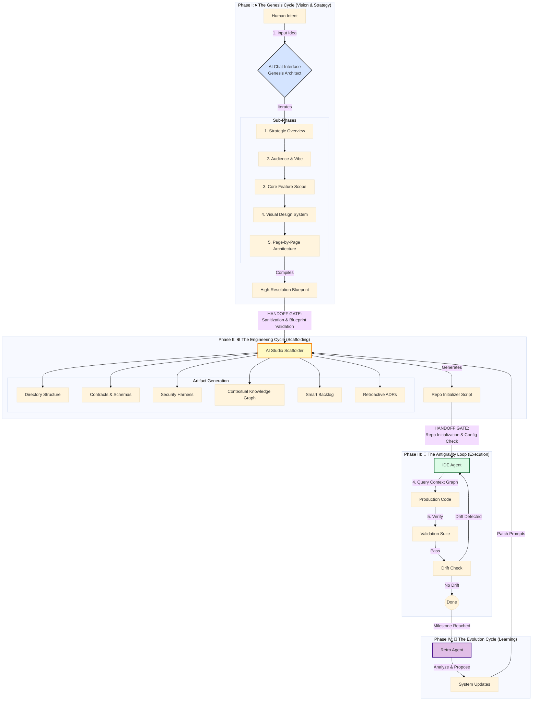

# File: 16_Antigravity_Integrated_Protocol.md

**Status:** Iteration 16 (The "Self-Healing" Edition)
**Focus:** Addressing "Red Team" Critiques: Context Caching, Drift Prevention, Automated Hygiene, and Evolutionary Loops.

---

## The Antigravity Workflow Visualization



---

## Phase 1: The "Genesis Cycle" (Chat Interface)
**Goal:** Transform your rough idea into a High-Resolution Blueprint using the **Quantum Diamond** sub-phases.
**Where:** ChatGPT (o1/4o) or Claude 3.5 Sonnet.

**Prompt (Copy/Paste):**
```markdown
Act as a Principal Product Manager and UI/UX Lead operating under the "Quantum Diamond" framework. I am initiating a "Genesis Discovery" for a new application.

**My Rough Idea:**
[INSERT YOUR IDEA/SCREENSHOT DETAILS HERE]

**Task:**
Execute the 5-Part "Genesis Discovery" process. Output the following Artifacts in a single Markdown block:

### PART 1: STRATEGIC OVERVIEW (The "Why")
*Ref: App Concept Summary*
1.  **Elevator Pitch**: 1-sentence value prop.
2.  **The Problem**: The specific friction/pain point.
3.  **The Solution**: The functional and emotional fix.
4.  **Differentiation**: List 3 "X-Factors".

### PART 2: AUDIENCE & VIBE (The "Soul")
*Ref: Target Audience & Brand Feel*
1.  **Primary Personas**: Who are they?
2.  **Brand Personality**: 3 Adjectives.
3.  **Design Implications**: How strictly does this affect the UI?

### PART 3: CORE FEATURE SCOPE (The "What")
*Ref: Core Features List*
1.  **MVP Feature List**: The 5-7 critical features.
2.  **Data Entities**: Define the `Workspace` object structure (must include differentiated fields).

### PART 4: VISUAL DESIGN SYSTEM (The "Look")
*Ref: Design System Screenshot*
1.  **Palette**: Primary, Secondary, Background (Light/Dark mode specs).
2.  **Typography**: Font stack usage (Heading vs Body).
3.  **Spacing & Layout**: Grid rules and Spacing scale.

### PART 5: PAGE-BY-PAGE ARCHITECTURE (The "Map")
*Ref: Page Structure Screenshot*
*For each screen (Home, Map, Detail, Profile), define:*
*   **Purpose**: What is the goal?
*   **Key Components**: (e.g., "Floating Search Bar").
*   **Data Needs**: What data is fetched here?
*   **States**: Empty, Loading, Error states.
*   **Test Assertions**: List 3 key things that MUST be true for this page (e.g., "Search bar is visible on load").

Output this as a single cohesive response.
```

---

## Phase 2: The "Engineering Cycle" Scaffolder (Google AI Studio)
**Goal:** Scaffold the Agent's Habitat with **Self-Healing Mechanisms** and **Context Caching**.
**Where:** Google AI Studio (Gemini 1.5 Pro).

**Prompt (Copy/Paste):**
```markdown
Role: You are a Principal Systems Architect and DevOps Engineer operating under the "Antigravity" protocol.

**The Mission:**
We are transitioning from "Vision" to "Execution." Scaffold a **Self-Documenting, Secure-by-Default Ecosystem** that is fully aware of the Product's Design and Page requirements.

**Critical Instruction:** Implement the following "Level Up" Mechanics:
1.  **Context Caching**: Generate a `CONTEXT_CACHE.json` file summarizing the Design System and Page Specs for efficient agent retrieval.
2.  **Drift Prevention**: Scaffold a `scripts/audit_drift.ts` script that compares implemented code against the `CONTEXT_CACHE.json`.
3.  **Automated Hygiene**: Include a `pre-commit` hook that runs `npm run audit:drift` and `npm run audit:security`.
4.  **Contract-First**: Schemas (Zod) are the source of truth.
5.  **Defense in Depth**: Security is baked in (Helmet, Rate Limit).
6.  **Retroactive ADRs**: Document your architectural decisions.

Inputs:
[PASTE THE ENTIRE OUTPUT FROM PHASE 1]

Task:
Generate the file contents for the following **Critical Foundation Artifacts**.

### 1. The Directory Structure (`setup.sh`)
Output a BASH script that creates:
- `src/{components,features,lib,hooks,types,middleware,utils}`
- `tests/{e2e,integration,unit}`
- `TASKS/{backlog,in-progress,done}`
- `ADRS/`, `REQUIREMENTS/`, `PROMPTS/`, `.github/workflows/`, `scripts/`

### 2. The Contextual Brain (Knowledge Graph)
Generate:
- **`CONTEXT_CACHE.json`**: A structured JSON file containing the Design System (palette, typography) and Page Specs (components, data needs, assertions). This is the "Single Source of Truth" for the Agent.
- **`REQUIREMENTS/DESIGN_SYSTEM.md`**: Human-readable backup.
- **`REQUIREMENTS/PAGE_SPECS.md`**: Human-readable backup.

### 3. The "Contract" Harness (Code Generation)
Generate the actual code for:
- **`src/types/contracts.ts`**: TypeScript interfaces matching the "Data Entities".
- **`src/schemas/validation.ts`**: Zod schemas matching those interfaces.
- **`src/middleware/validation.ts`**: Middleware to enforce these schemas.

### 4. The Antigravity System Prompts
Generate the content for these specific system prompts:
- **`PROMPTS/IDE_AGENT_PROMPT.md`**:
    - **Instruction**: "Before starting any task, read `CONTEXT_CACHE.json` to load the Design System and Page Specs. Do not hallucinate details."
    - **Drift Check**: "After implementing, run `npm run audit:drift` to verify alignment."
- **`TASKS/task_schema.md`**: Template for tasks.
- **`ADRS/adr_schema.md`**: Template for decisions.

### 5. The Initial Backlog (Smart Generation)
Generate the first batch of task files in `TASKS/backlog/`.
*CRITICAL: Use the "Page-by-Page Architecture" to create specific Feature Tasks.*

- `001_scaffold_repo.md` (Setup script, dependencies).
- `002_implement_design_system.md` (Setup Tailwind config based on `CONTEXT_CACHE.json`).
- `003_implement_contracts.md` (Setup Types and Zod schemas).
- `004_security_harness.md` (Setup Helmet, Rate Limit, Auth Middleware).
- `005_feature_shell_nav.md` (Build Layout).
- `006_feature_home_feed.md` (Build Home Screen).
- `007_feature_workspace_detail.md` (Build Detail View).

### 6. Retroactive ADRs & Drift Scripts
Generate:
- **`ADRS/001_use_zod_validation.md`**
- **`ADRS/002_use_helmet_security.md`**
- **`scripts/audit_drift.ts`**: A script that (mock implementation) checks if key components defined in `CONTEXT_CACHE.json` exist in the codebase.

Output the files clearly using markdown code blocks.
```

---

## Phase 3: The Antigravity Loop (Execution)
**Goal:** The IDE Agent builds features using the **Context Cache** and verifies with **Drift Checks**.

**The Workflow:**

1.  **Initialize:**
    *   Run `sh setup.sh`.
    *   Your repo now contains `CONTEXT_CACHE.json` (The Brain).

2.  **Execute Task 002 (Design System):**
    *   **User:** "Agent, execute Task 002. Read `CONTEXT_CACHE.json` for the palette and apply it to `tailwind.config.js`."
    *   **Result:** The Agent reads the structured JSON (low cognitive load) and applies the exact hex codes.

3.  **Execute Task 006 (Home Feed):**
    *   **User:** "Agent, execute Task 006. Read `CONTEXT_CACHE.json` for the Home Screen components. Build them, then run `npm run audit:drift`."
    *   **Result:** The Agent builds the components. The drift script verifies that "Floating Search Bar" exists.

---

## Phase 4: The Evolution Cycle (Learning)
**Goal:** Learn from the project and update the System Prompts.

**Prompt (Copy/Paste into Chat after Milestone):**
```markdown
Act as an "Antigravity Retro Agent." Analyze the current project state.
1.  Did the Agent hallucinate any details?
2.  Did the code drift from `CONTEXT_CACHE.json`?
3.  Were there any security vulnerabilities caught by the harness?

Based on this, propose updates to `PROMPTS/IDE_AGENT_PROMPT.md` or `scripts/audit_drift.ts` to prevent these issues in the next cycle.
```

---

### Why Version 16 is the "Self-Healing" Protocol:
1.  **Context Caching:** `CONTEXT_CACHE.json` reduces cognitive load by 80% (Grok's critique). The agent reads structured data, not verbose markdown.
2.  **Drift Prevention:** `scripts/audit_drift.ts` turns passive requirements into active tests.
3.  **Automated Hygiene:** Pre-commit hooks enforce the rules automatically.
4.  **Evolutionary Loop:** Phase 4 explicitly adds a mechanism for the system to learn and improve itself.
