# File: 17_Antigravity_Integrated_Protocol.md

**Status:** Iteration 17 (The "Cybernetic" Edition)
**Focus:** Addressing "Red Team" Critiques: Context Compilation, Lockfiles, Self-Healing Validation, and Automated Evolution.

---

## The Antigravity Workflow Visualization

```mermaid
---
config:
  layout: dagre
  theme: base
---
flowchart TB
 subgraph s1["Sub-Phases"]
        P1["1. Strategic Overview"]
        P2["2. Audience & Vibe"]
        P3["3. Core Feature Scope"]
        P4["4. Visual Design System"]
        P5["5. Page-by-Page Architecture"]
  end
 subgraph subGraph1["Phase I: 🌀 The Genesis Cycle (Vision & Strategy)"]
        A["Human Intent"]
        B{"AI Chat Interface<br>Genesis Architect"}
        C["High-Resolution Blueprint"]
        s1
  end
 subgraph subGraph2["Artifact Generation"]
        D1["Directory Structure"]
        D2["Contracts & Schemas"]
        D3["Security Harness"]
        D4["Context Compiler & Lockfiles"]
        D5["Smart Backlog"]
        D6["ADR Templates"]
  end
 subgraph subGraph3["Phase II: ⚙️ The Engineering Cycle (Scaffolding)"]
        S["AI Studio Scaffolder"]
        Repo["Repo Initializer Script"]
        subGraph2
  end
 subgraph subGraph4["Phase III: 🚀 The Antigravity Loop (Execution)"]
        IDE["IDE Agent"]
        Code["Production Code"]
        Tests["Validation Suite"]
        Drift["Self-Healing Validator"]
        Done(("Done"))
  end
 subgraph subGraph5["Phase IV: 🧬 The Evolution Cycle (Learning)"]
        Retro["Post-Mortem Engine"]
        Update["Prompt Migrations"]
  end
    
    %% The Genesis Flow
    A -- "1. Input Idea" --> B
    B -- Iterates --> P1
    P1 --> P2 --> P3 --> P4 --> P5
    P5 -- Compiles --> C
    
    %% Handoff 1: Vision to Engineering
    C -- "HANDOFF GATE:<br>Sanitizer Script & Blueprint Lock" --> S
    
    %% The Scaffolding Flow
    S -- Generates --> Repo
    S --> D1 & D2 & D3 & D4 & D5 & D6
    
    %% Handoff 2: Scaffold to Execution
    Repo -- "HANDOFF GATE:<br>Repo Initialization & Context Compilation" --> IDE
    
    %% The Execution Flow
    IDE -- "4. Query Context Lock" --> Code
    Code -- "5. Verify" --> Tests
    Tests -- Pass --> Drift
    Drift -- "No Drift" --> Done
    Drift -- "Drift Detected" --> IDE
    
    %% Evolution Flow
    Done -- "Milestone Reached" --> Retro
    Retro -- "Analyze & Propose" --> Update
    Update -- "Patch Prompts" --> S

    style B fill:#d4e4ff,stroke:#333,stroke-width:2px
    style S fill:#fff9c4,stroke:#f57c00,stroke-width:2px
    style IDE fill:#dcfce7,stroke:#166534,stroke-width:2px
    style Retro fill:#e1bee7,stroke:#4a148c,stroke-width:2px
```



---

## Phase 1: The "Genesis Cycle" (Chat Interface)
**Goal:** Transform your rough idea into a High-Resolution Blueprint using the **Quantum Diamond** sub-phases.
**Where:** ChatGPT (o1/4o) or Claude 3.5 Sonnet.

**Prompt (Copy/Paste):**
```markdown
Act as a Principal Product Manager and UI/UX Lead operating under the "Quantum Diamond" framework. I am initiating a "Genesis Discovery" for a new application.

**My Rough Idea:**
[INSERT YOUR IDEA/SCREENSHOT DETAILS HERE]

**Task:**
Execute the 5-Part "Genesis Discovery" process. Output the following Artifacts in a single Markdown block:

### PART 1: STRATEGIC OVERVIEW (The "Why")
*Ref: App Concept Summary*
1.  **Elevator Pitch**: 1-sentence value prop.
2.  **The Problem**: The specific friction/pain point.
3.  **The Solution**: The functional and emotional fix.
4.  **Differentiation**: List 3 "X-Factors".

### PART 2: AUDIENCE & VIBE (The "Soul")
*Ref: Target Audience & Brand Feel*
1.  **Primary Personas**: Who are they?
2.  **Brand Personality**: 3 Adjectives.
3.  **Design Implications**: How strictly does this affect the UI?

### PART 3: CORE FEATURE SCOPE (The "What")
*Ref: Core Features List*
1.  **MVP Feature List**: The 5-7 critical features.
2.  **Data Entities**: Define the `Workspace` object structure (must include differentiated fields).

### PART 4: VISUAL DESIGN SYSTEM (The "Look")
*Ref: Design System Screenshot*
1.  **Palette**: Primary, Secondary, Background (Light/Dark mode specs).
2.  **Typography**: Font stack usage (Heading vs Body).
3.  **Spacing & Layout**: Grid rules and Spacing scale.

### PART 5: PAGE-BY-PAGE ARCHITECTURE (The "Map")
*Ref: Page Structure Screenshot*
*For each screen (Home, Map, Detail, Profile), define:*
*   **Purpose**: What is the goal?
*   **Key Components**: (e.g., "Floating Search Bar").
*   **Data Needs**: What data is fetched here?
*   **States**: Empty, Loading, Error states.
*   **Test Assertions**: List 3 key things that MUST be true for this page (e.g., "Search bar is visible on load").

Output this as a single cohesive response.
```

---

## Phase 2: The "Engineering Cycle" Scaffolder (Google AI Studio)
**Goal:** Scaffold the Agent's Habitat with **Context Compilation**, **Lockfiles**, and **Self-Healing Validation**.
**Where:** Google AI Studio (Gemini 1.5 Pro).

**Prompt (Copy/Paste):**
```markdown
Role: You are a Principal Systems Architect and DevOps Engineer operating under the "Antigravity" protocol.

**The Mission:**
We are transitioning from "Vision" to "Execution." Scaffold a **Self-Documenting, Secure-by-Default Ecosystem** that is fully aware of the Product's Design and Page requirements.

**Critical Instruction:** Implement the following "Level Up" Mechanics:
1.  **Context Compilation**: Generate a `context.lock.json` file summarizing the Design System and Page Specs for efficient agent retrieval.
2.  **Blueprint Locking**: Generate a `BLUEPRINT.lock.md` as the canonical truth.
3.  **Security Locking**: Generate a `SECURITY.lock.md` defining immutable security rules.
4.  **Self-Healing Validation**: Scaffold a `scripts/validate_drift.ts` script that compares implemented code against the `context.lock.json`.
5.  **Automated Hygiene**: Include a `pre-commit` hook that runs `npm run validate:drift` and `npm run validate:security`.
6.  **Contract-First**: Schemas (Zod) are the source of truth.
7.  **Defense in Depth**: Security is baked in (Helmet, Rate Limit).

Inputs:
[PASTE THE ENTIRE OUTPUT FROM PHASE 1]

Task:
Generate the file contents for the following **Critical Foundation Artifacts**.

### 1. The Directory Structure (`setup.sh`)
Output a BASH script that creates:
- `src/{components,features,lib,hooks,types,middleware,utils}`
- `tests/{e2e,integration,unit}`
- `TASKS/{backlog,in-progress,done}`
- `ADRS/`, `REQUIREMENTS/`, `PROMPTS/`, `.github/workflows/`, `scripts/`

### 2. The Contextual Brain (Lockfiles)
Generate:
- **`context.lock.json`**: A structured JSON file containing the Design System (palette, typography) and Page Specs (components, data needs, assertions). This is the "Single Source of Truth" for the Agent.
- **`BLUEPRINT.lock.md`**: The immutable vision document.
- **`SECURITY.lock.md`**: The immutable security rules (CORS, Helmet, Rate Limits).

### 3. The "Contract" Harness (Code Generation)
Generate the actual code for:
- **`src/types/contracts.ts`**: TypeScript interfaces matching the "Data Entities".
- **`src/schemas/validation.ts`**: Zod schemas matching those interfaces.
- **`src/middleware/validation.ts`**: Middleware to enforce these schemas.

### 4. The Antigravity System Prompts
Generate the content for these specific system prompts:
- **`PROMPTS/IDE_AGENT_PROMPT.md`**:
    - **Instruction**: "Before starting any task, read `context.lock.json` to load the Design System and Page Specs. Do not hallucinate details."
    - **Drift Check**: "After implementing, run `npm run validate:drift` to verify alignment."
- **`TASKS/task_schema.md`**: Template for tasks.
- **`ADRS/adr_schema.md`**: Template for decisions.

### 5. The Initial Backlog (Smart Generation)
Generate the first batch of task files in `TASKS/backlog/`.
*CRITICAL: Use the "Page-by-Page Architecture" to create specific Feature Tasks.*

- `001_scaffold_repo.md` (Setup script, dependencies).
- `002_implement_design_system.md` (Setup Tailwind config based on `context.lock.json`).
- `003_implement_contracts.md` (Setup Types and Zod schemas).
- `004_security_harness.md` (Setup Helmet, Rate Limit, Auth Middleware based on `SECURITY.lock.md`).
- `005_feature_shell_nav.md` (Build Layout).
- `006_feature_home_feed.md` (Build Home Screen).
- `007_feature_workspace_detail.md` (Build Detail View).

### 6. Retroactive ADRs & Validation Scripts
Generate:
- **`ADRS/001_use_zod_validation.md`**
- **`ADRS/002_use_helmet_security.md`**
- **`scripts/validate_drift.ts`**: A script that (mock implementation) checks if key components defined in `context.lock.json` exist in the codebase.

Output the files clearly using markdown code blocks.
```

---

## Phase 3: The Antigravity Loop (Execution)
**Goal:** The IDE Agent builds features using the **Context Lock** and verifies with **Self-Healing Validation**.

**The Workflow:**

1.  **Initialize:**
    *   Run `sh setup.sh`.
    *   Your repo now contains `context.lock.json` (The Brain) and `SECURITY.lock.md` (The Shield).

2.  **Execute Task 002 (Design System):**
    *   **User:** "Agent, execute Task 002. Read `context.lock.json` for the palette and apply it to `tailwind.config.js`."
    *   **Result:** The Agent reads the structured JSON (low cognitive load) and applies the exact hex codes.

3.  **Execute Task 006 (Home Feed):**
    *   **User:** "Agent, execute Task 006. Read `context.lock.json` for the Home Screen components. Build them, then run `npm run validate:drift`."
    *   **Result:** The Agent builds the components. The validation script verifies that "Floating Search Bar" exists.

---

## Phase 4: The Evolution Cycle (Learning)
**Goal:** Learn from the project and update the System Prompts via **Post-Mortem Engine**.

**Prompt (Copy/Paste into Chat after Milestone):**
```markdown
Act as an "Antigravity Post-Mortem Engine." Analyze the current project state.
1.  Did the Agent hallucinate any details?
2.  Did the code drift from `context.lock.json`?
3.  Were there any security vulnerabilities caught by the harness?

Based on this, propose updates to `PROMPTS/IDE_AGENT_PROMPT.md` or `scripts/validate_drift.ts` to prevent these issues in the next cycle.
```

---

### Why Version 17 is the "Cybernetic" Protocol:
1.  **Context Compilation:** `context.lock.json` reduces cognitive load by 80%, providing a deterministic source of truth.
2.  **Lockfiles:** `BLUEPRINT.lock.md` and `SECURITY.lock.md` prevent drift and unauthorized changes.
3.  **Self-Healing Validation:** `scripts/validate_drift.ts` turns passive requirements into active tests.
4.  **Automated Hygiene:** Pre-commit hooks enforce the rules automatically.
5.  **Evolutionary Loop:** Phase 4 explicitly adds a mechanism for the system to learn and improve itself via the Post-Mortem Engine.
