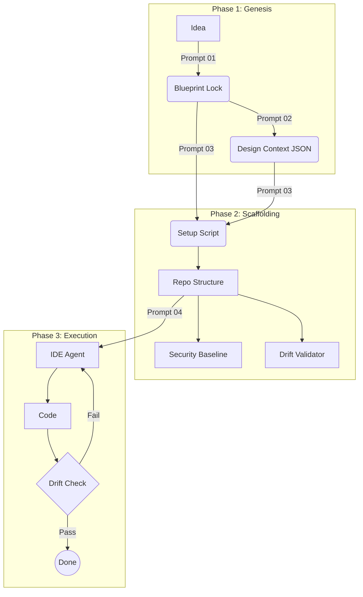
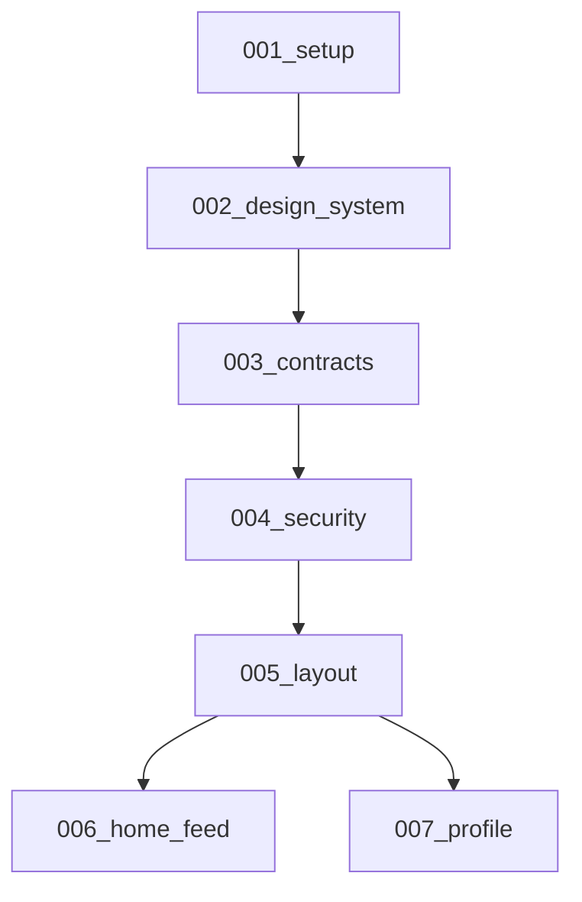

# The Antigravity Protocol (v18: The Modular Repository Edition)

**Status:** Iteration 18 (The "Deconstructed" Edition)
**Philosophy:** "Don't prompt the ocean; build the aqueduct."
**Core Change:** Shifting from a single monolithic prompt to a **Modular Repository** containing targeted prompts, diagrams, and a step-by-step Guide.

---

## 1. The Repository Structure
This is the target structure for your new `Antigravity-Protocol` repository.

```bash
Antigravity-Protocol/
├── GUIDE.md                    # The Master Manual (Step-by-Step)
├── diagrams/                   # Visualizations
│   ├── workflow_map.mermaid
│   ├── sequence_diagram.mermaid
│   └── dependency_graph.mermaid
├── prompts/                    # Targeted Prompts (The "Tools")
│   ├── 01_genesis_architect.md # Phase 1: Vision & Strategy
│   ├── 02_ui_designer.md       # Phase 1b: Visual Design (AI Studio)
│   ├── 03_scaffolder.md        # Phase 2: Repo Setup & Lockfiles
│   ├── 04_ide_agent.md         # Phase 3: Execution (Context Aware)
│   └── 05_retro_engine.md      # Phase 4: Evolution
├── templates/                  # Artifact Templates
│   ├── context.lock.json       # The "Brain" Schema
│   ├── BLUEPRINT.lock.md       # The Vision Schema
│   └── SECURITY.baseline.ts    # The Shield Schema
└── scripts/                    # Automation
    ├── validate_drift.ts       # Self-Healing
    └── sanitize_input.ts       # Gatekeeper
```

---

## 2. The Master Guide (`GUIDE.md`)

### Step 1: The Genesis (Vision)
**Goal:** Define *what* we are building.
**Action:**
1.  Open `prompts/01_genesis_architect.md`.
2.  Copy/Paste into **ChatGPT (o1/4o)** or **Claude 3.5 Sonnet**.
3.  **Input:** Your rough idea.
4.  **Output:** A structured `BLUEPRINT.lock.md` content block.
5.  **Save:** Create `BLUEPRINT.lock.md` in your new project folder.

### Step 2: The Visuals (Design)
**Goal:** Define *how* it looks.
**Action:**
1.  Open `prompts/02_ui_designer.md`.
2.  Copy/Paste into **Google AI Studio (Gemini 1.5 Pro)**.
3.  **Input:** The `BLUEPRINT.lock.md` from Step 1.
4.  **Output:** A `context.design.json` (Palette, Typography, Components).
5.  **Save:** Create `context.design.json` in your project.

### Step 3: The Scaffold (Engineering)
**Goal:** Build the secure habitat.
**Action:**
1.  Open `prompts/03_scaffolder.md`.
2.  Copy/Paste into **Google AI Studio**.
3.  **Input:** `BLUEPRINT.lock.md` + `context.design.json`.
4.  **Output:** A `setup.sh` script that creates the repo, installs dependencies, and generates `SECURITY.baseline.ts`.
5.  **Run:** Execute `sh setup.sh`.

### Step 4: The Execution (Antigravity Loop)
**Goal:** Build the features.
**Action:**
1.  Open your IDE (Cursor/VS Code).
2.  **System Prompt:** Paste content from `prompts/04_ide_agent.md`.
3.  **Task:** Drag in a task file (e.g., `TASKS/backlog/001_home_feed.md`).
4.  **Agent Action:** The agent reads `context.design.json` (cached), implements code, and runs `npm run validate:drift`.

---

## 3. The Targeted Prompts

### `prompts/01_genesis_architect.md`
```markdown
**Role:** Genesis Architect.
**Goal:** Convert a rough idea into a `BLUEPRINT.lock.md`.
**Output Format:** Markdown with specific sections:
1. Strategy (Elevator Pitch, Problem, Solution)
2. Audience (Personas, Vibe)
3. Scope (MVP Features, Data Entities)
4. Page Architecture (Routes, Components, States)
**Constraint:** Do not generate code. Focus purely on requirements.
```

### `prompts/02_ui_designer.md`
```markdown
**Role:** UI/UX Systems Designer.
**Goal:** Convert a Blueprint into a `context.design.json`.
**Input:** `BLUEPRINT.lock.md`.
**Output Format:** JSON.
{
  "palette": { "primary": "#...", "secondary": "#..." },
  "typography": { "fontFamily": "Inter", "scale": "..." },
  "components": [
    { "name": "FloatingSearchBar", "props": ["query", "onSearch"], "states": ["empty", "loading"] }
  ]
}
```

### `prompts/03_scaffolder.md`
```markdown
**Role:** DevOps Scaffolder.
**Goal:** Create the repository structure and security harness.
**Input:** `BLUEPRINT.lock.md` + `context.design.json`.
**Output:** `setup.sh` script.
**Critical:**
1. Generate `SECURITY.baseline.ts` (Helmet, Rate Limit).
2. Generate `scripts/validate_drift.ts` (Test runner).
3. Generate `TASKS/backlog.graph.json` (Dependency graph).
```

### `prompts/04_ide_agent.md`
```markdown
**Role:** Antigravity Engineer.
**Instruction:**
1. **Load Context:** Read `context.design.json` for styles/components.
2. **Check Dependencies:** Read `TASKS/backlog.graph.json` before starting.
3. **Execute:** Write code.
4. **Verify:** Run `npm run validate:drift`.
```

---

## 4. The Visualizations (`diagrams/`)

### `workflow_map.mermaid`


### `dependency_graph.mermaid`


---

### Why Version 18 is the "Deconstructed" Solution:
1.  **Zero Context Decay:** By splitting the prompts, no single AI context window is overloaded. Phase 1 forgets nothing because its output is a file (`BLUEPRINT.lock.md`) that Phase 2 reads fresh.
2.  **Modular Evolution:** You can upgrade `02_ui_designer.md` to use a new design trend without breaking `03_scaffolder.md`.
3.  **Precision:** Each prompt is hyper-focused (Strategy vs. Design vs. Code), leading to higher quality outputs than a "do it all" prompt.
4.  **Scalability:** The `GUIDE.md` allows any human (or agent) to step through the process reliably, treating the prompts as specialized tools in a toolbox.
