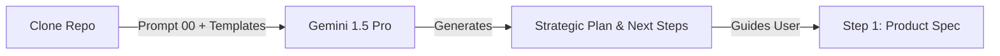

# Phase 0: The "Kickoff" (Gemini 1.5 Pro)

**Goal:** Initialize the project strategy and get a personalized guide for the rest of the process.
**Where:** Google AI Studio (Gemini 1.5 Pro) or Gemini Advanced.

---

## The Workflow



## The Prompt

Copy this prompt and paste it into **Gemini 1.5 Pro**.
**Attachments:** Drag and drop the `templates/` folder (or specific templates like `BLUEPRINT.lock.md`) into the chat context if possible, or mention you have them.

```markdown
Act as a Principal Technical Program Manager and AI Solutions Architect.

**Context:**
I have just cloned the "Quantum Diamond Forge" repository to start a new project.
I have access to the following templates in my local environment:
- `PRODUCT_SPEC.md`
- `TECHNICAL_BLUEPRINT.md`
- `context.design.json`
- `setup.sh`

**My Rough Idea:**
[INSERT YOUR IDEA HERE]

**Task:**
1.  **Analyze my idea** and tell me which "Expert Roles" (Backend, Architect, DevOps, etc.) I will likely need to invoke later.
2.  **Create a high-level Roadmap** for this specific project using the Quantum Diamond phases.
3.  **Guide me:** Tell me exactly what to do next. (e.g., "Now, run `./forge.sh prompt 1` and paste it into ChatGPT to generate your Product Spec").

**Goal:**
Give me confidence and a clear path forward.
```
