# Phase 1: The "Genesis Cycle" (Vision & Strategy)

**Goal:** Transform your rough idea into a High-Resolution Blueprint using the **Quantum Diamond** sub-phases.
**Where:** ChatGPT (o1/4o) or Claude 3.5 Sonnet.

---

## The Genesis Workflow

This phase is about **crystallization**. You start with a fuzzy idea, and the AI acts as a "Genesis Architect" to structure it into a locked blueprint.

```mermaid
flowchart TB
 subgraph s1["Sub-Phases"]
        P1["1. Strategic Overview"]
        P2["2. Audience & Vibe"]
        P3["3. Core Feature Scope"]
        P4["4. Visual Design System"]
        P5["5. Page-by-Page Architecture"]
  end
 subgraph subGraph1["Phase I: 🌀 The Genesis Cycle (Vision & Strategy)"]
        A["Human Intent"]
        B{"AI Chat Interface<br>Genesis Architect"}
        C["High-Resolution Blueprint"]
        s1
  end
    
    %% The Genesis Flow
    A -- "1. Input Idea" --> B
    B -- Iterates --> P1
    P1 --> P2 --> P3 --> P4 --> P5
    P5 -- Compiles --> C
```



---

## The Process

1.  **Copy the Prompt:** Run `./forge.sh prompt 1` (or copy from below).
2.  **Paste into Web AI:** Use a high-reasoning model like **ChatGPT o1** or **Claude 3.5 Sonnet**.
3.  **Input Your Idea:** Be as specific or as vague as you want. The prompt is designed to extract the necessary details.
4.  **Receive the Blueprint:** The AI will output a structured Markdown block.
5.  **Lock It:** Save this output to `templates/BLUEPRINT.lock.md` (or your project root). This file becomes the immutable source of truth for the next phases.

---

## The Prompt (Detailed)

This is the exact prompt used to drive the Genesis Cycle.

```markdown
Act as a Principal Product Manager and UI/UX Lead operating under the "Quantum Diamond" framework. I am initiating a "Genesis Discovery" for a new application.

**My Rough Idea:**
[INSERT YOUR IDEA/SCREENSHOT DETAILS HERE]

**Task:**
Execute the 5-Part "Genesis Discovery" process. Output the following Artifacts in a single Markdown block:

### PART 1: STRATEGIC OVERVIEW (The "Why")
*Ref: App Concept Summary*
1.  **Elevator Pitch**: 1-sentence value prop.
2.  **The Problem**: The specific friction/pain point.
3.  **The Solution**: The functional and emotional fix.
4.  **Differentiation**: List 3 "X-Factors".

### PART 2: AUDIENCE & VIBE (The "Soul")
*Ref: Target Audience & Brand Feel*
1.  **Primary Personas**: Who are they?
2.  **Brand Personality**: 3 Adjectives.
3.  **Design Implications**: How strictly does this affect the UI?

### PART 3: CORE FEATURE SCOPE (The "What")
*Ref: Core Features List*
1.  **MVP Feature List**: The 5-7 critical features.
2.  **Data Entities**: Define the `Workspace` object structure (must include differentiated fields).

### PART 4: VISUAL DESIGN SYSTEM (The "Look")
*Ref: Design System Screenshot*
1.  **Palette**: Primary, Secondary, Background (Light/Dark mode specs).
2.  **Typography**: Font stack usage (Heading vs Body).
3.  **Spacing & Layout**: Grid rules and Spacing scale.

### PART 5: PAGE-BY-PAGE ARCHITECTURE (The "Map")
*Ref: Page Structure Screenshot*
*For each screen (Home, Map, Detail, Profile), define:*
*   **Purpose**: What is the goal?
*   **Key Components**: (e.g., "Floating Search Bar").
*   **Data Needs**: What data is fetched here?
*   **States**: Empty, Loading, Error states.
*   **Test Assertions**: List 3 key things that MUST be true for this page (e.g., "Search bar is visible on load").

Output this as a single cohesive response.
```
