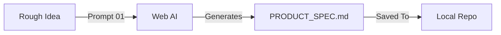

# Phase 1: Product Specification (The "Why" & "What")

**Goal:** Crystallize the rough idea into a clear, user-centric Product Specification.
**Where:** ChatGPT (o1/4o) or Claude 3.5 Sonnet.

---

## The Workflow



## The Prompt

Copy this prompt and paste it into the Web AI along with your rough idea.

```markdown
Act as a Principal Product Manager operating under the "Antigravity" framework.

**My Rough Idea:**
[INSERT YOUR IDEA HERE]

**Task:**
Analyze this idea and output a structured **Product Specification** in Markdown.

**Output Format (PRODUCT_SPEC.md):**

# Product Specification: [App Name]

## 1. Narrative
*   **Elevator Pitch**: One sentence value proposition.
*   **The Problem**: The specific friction or pain point being solved.
*   **The Solution**: The functional and emotional resolution.

## 2. Audience & Vibe
*   **Primary Persona**: Detailed profile (Name, Role, Motivation).
*   **Secondary Persona**: (Optional).
*   **Vibe**: 3 adjectives describing the brand personality (e.g., "Clinical, Trustworthy, Efficient" or "Playful, Vibrant, Social").

## 3. Core Feature Scope (MVP)
*   **Feature 1**: [Name] - [Description] - [User Benefit]
*   **Feature 2**: ...
*   **Feature 3**: ...
*   **Feature 4**: ...
*   **Feature 5**: ...

## 4. Differentiation
*   **X-Factor 1**: What makes this unique?
*   **X-Factor 2**: ...
*   **X-Factor 3**: ...

## 5. Success Metrics
*   **Key Metric**: What is the #1 indicator of success?
```
