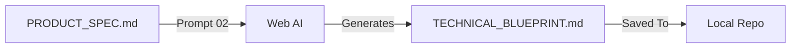

# Phase 2: Technical Blueprint (The "How")

**Goal:** Translate the Product Spec into a robust, secure Technical Blueprint.
**Where:** ChatGPT (o1/4o) or Claude 3.5 Sonnet.

---

## The Workflow



## The Prompt

Copy this prompt and paste it into the Web AI. **Attach or paste your `PRODUCT_SPEC.md` first.**

```markdown
Act as a Principal Software Architect and Security Engineer.

**Input:**
I have provided the `PRODUCT_SPEC.md` for a new application.

**Task:**
Design the Technical Architecture for this product. Output a **Technical Blueprint** in Markdown.

**Output Format (TECHNICAL_BLUEPRINT.md):**

# Technical Blueprint

## 1. Domain Architecture
*   **Entities**: List the core data entities (e.g., User, Workspace, Ticket).
*   **Relationships**: Describe how they connect (e.g., User has many Tickets).

## 2. Technology Stack
*   **Framework**: Next.js (App Router).
*   **Styling**: Tailwind CSS.
*   **Database**: Supabase (PostgreSQL).
*   **Validation**: Zod (Strict Schemas).
*   **State**: React Query / Zustand.

## 3. Security & Compliance (Shift Left)
*   **Authentication**: Supabase Auth + RLS (Row Level Security) Policies.
*   **Input Validation**: Strict Zod schemas for ALL API inputs.
*   **Headers**: Helmet/CSP configuration strategy.
*   **Rate Limiting**: Strategy for public API routes.

## 4. Operational Maturity
*   **Observability**: Structured logging strategy (Correlation IDs).
*   **Health Checks**: Deep database connectivity check endpoint.

## 5. CI/CD Pipeline
*   **Pre-commit**: Linting, Type Checking, Secret Scanning.
*   **CI Steps**: Vitest (Unit), Playwright (E2E), Dependency Audit.
```
