# CI/CD Pipeline & Development Workflow

## Overview

This document outlines the Continuous Integration (CI) pipeline and the standard development workflow for projects built with the **Quantum Diamond Forge** protocol. It details the lifecycle of a code change from a developer's workstation to the main branch on GitHub.

## Table of Contents

1. [Workflow Diagram](#workflow-diagram)
2. [Development Workflow Phases](#development-workflow-phases)
3. [Security Scanning Results Guide](#security-scanning-results-guide)
4. [How to Commit Changes](./how_to_commit.md) - Step-by-step commit guide with pre-commit hook testing
5. [Git Workflow Quick Reference](./git_workflow.md) - Conventional commits, aliases, and best practices
6. [Related Documentation](#related-documentation)

## Related Documentation

- **[GitHub Repository Setup Guide](./github_setup.md)** - Configure GitHub Actions, security scanning, and branch protection
- **[How to Commit Changes](./how_to_commit.md)** - Step-by-step commit guide with pre-commit hook testing
- **[Git Workflow Guide](./git_workflow.md)** - Detailed guide on git commands, conventional commits, and pre-commit hooks
- **[ADR-039: CI/CD Pipeline Strategy](../../docs/adr/039_ci_cd_pipeline.md)** - Architectural decision for CI/CD approach
- **[ADR-040: Security Scanning Strategy](../../docs/adr/040_security_scanning_strategy.md)** - Security scanning tools and philosophy
- **[ADR-041: Git Workflow Automation](../../docs/adr/041_git_workflow_automation.md)** - Git workflow best practices

## Branching Strategy

This protocol uses a **feature branch workflow** for controlled releases:

```
feature/* → main (via Pull Request)
```

### Branch Purposes

| Branch | Purpose | CI Runs | Deployment |
|--------|---------|---------|------------|
| `feature/*` | Active development | ✅ On PR | None |
| `main` | Production-ready | ✅ On push/PR | Production |

### Workflow

1. **Feature Development:**
   ```bash
   git checkout -b feature/add-new-feature
   # Make changes, commit, push
   git push origin feature/add-new-feature
   # Create PR: feature/add-new-feature → main
   ```

2. **Code Review & Merge:**
   - Create Pull Request to `main`
   - CI pipeline runs automatically
   - After approval and CI passes, merge
   - Tag release (optional): `git tag v1.0.0 && git push --tags`

### Branch Protection

The `main` branch has:
- ✅ CI pipeline checks (linting, tests, build)
- ✅ CodeQL security analysis (if enabled)
- ✅ PR review required
- ✅ Status checks must pass before merge

See [GitHub Repository Setup Guide](./github_setup.md) for configuration details.

## Workflow Diagram

The following sequence diagram illustrates the interaction between the Developer, their Local Workstation, and the specific entities within GitHub (Branches, PRs, CI).

```mermaid
---
config:
  theme: base
---
sequenceDiagram
    autonumber
    participant Dev as Developer
    participant Local as Local Workstation
    participant FeatBranch as Remote Feature Branch
    participant PR as Pull Request
    participant CI as GitHub Actions (CI)
    participant MainBranch as Remote Main Branch

    Note over Dev, Local: 1. Feature Start
    Dev->>Local: git checkout -b feature/new-feature

    Note over Dev, Local: 2. Development Loop
    loop Coding & Local Testing
        Dev->>Local: Write Code
        Dev->>Local: npm run lint (Check Style)
        Dev->>Local: npm run test:unit (Verify Logic)
        Dev->>Local: (Optional) Manual Security Scan
    end

    Note over Dev, Local: 3. Commit & Push (Defense in Depth)
    Dev->>Local: git add .
    Local->>Local: Pre-commit Hook (Secret Detection)
    Note right of Local: 🛑 Blocking Gate:<br/>- No .env files<br/>- No hardcoded secrets<br/>- Blocks commit if violations found

    Dev->>Local: git commit -m "feat: add new feature"

    rect rgb(255, 255, 240)
        Note right of Local: ⚠️ Post-Commit Hook (Informational):<br/>- Auto-runs 'npm audit' (High Severity)<br/>- Checks local Dependabot status<br/>- Warns Dev immediately (does not block)
        Local-->>Dev: Display "Security Health Report"
    end

    Dev->>Local: git push -u origin feature/new-feature
    Local->>FeatBranch: Create/Update Branch

    Note over Dev, PR: 4. Pull Request
    Dev->>PR: Create PR (Feature -> Main)

    Note over PR, CI: 5. Automated Checks
    PR->>CI: Trigger "CI Pipeline" Workflow

    par CI Pipeline
        rect rgb(240, 248, 255)
            Note right of CI: CI Execution
            CI->>CI: Checkout Code
            CI->>CI: Install Dependencies
            CI->>CI: Linting & Tests
            CI->>CI: Build Frontend
        end
        CI-->>PR: Report Status (✅/❌)
    and Security Checks
        rect rgb(255, 240, 245)
            Note right of PR: GitHub Security
            PR->>PR: Dependabot Scan
            PR->>PR: CodeQL Analysis
            PR->>PR: Secret Scanning
        end
        PR-->>Dev: Report Vulnerabilities (in PR Interface)
    end

    alt Checks Fail
        PR-->>Dev: Notify Failure
        Dev->>Local: Fix Code & Push Again
        Local->>FeatBranch: Update Branch
        FeatBranch->>PR: Update PR
        PR->>CI: Re-trigger CI
    else Checks Pass
        Note over Dev, MainBranch: 6. Review & Merge
        Dev->>PR: Request Review
        PR->>MainBranch: Merge PR to 'main'

        Note over MainBranch, FeatBranch: 7. Cleanup
        MainBranch->>FeatBranch: Delete Remote Branch
    end

    Note over Dev, Local: 8. Local Cleanup
    Dev->>Local: git checkout main
    Dev->>Local: git pull origin main
    Local->>MainBranch: Fetch Latest
    Dev->>Local: git branch -d feature/new-feature
```



## Detailed Workflow Steps

### Phase 1: Developer Workstation (Local)

1.  **Create Feature Branch**
    *   **Command:** `git checkout -b feature/<name>`
    *   **Purpose:** Isolate changes from the stable `main` codebase.

2.  **Development & Verification**
    *   **Process:** Write code, update tests.
    *   **Verification:**
    *   Run `npm run lint` and `npm run test:unit`.
    *   **Post-Commit Hook:** After commit, an informational `npm audit --audit-level=high --production` runs and displays a Security Health Report (does not block).

3.  **Commit & Push**
    *   **Command:** `git commit` and `git push`.
    *   **Pre-commit Hook:** Automatically runs `.githooks/pre-commit` to validate:
        *   No `.env` files committed (except `.env.example`)
        *   No hardcoded secrets (API keys, tokens, passwords)
        *   Blocks commit if violations found
    *   **Entity:** Updates the **Remote Feature Branch** (`origin/feature/<name>`).
    *   **Best Practice:** Use [conventional commits](./GIT_WORKFLOW.md#conventional-commit-format) (e.g., `feat:`, `fix:`, `docs:`)

### Phase 2: GitHub (Remote)

4.  **Create Pull Request (PR)**
    *   **Action:** Create a PR merging **Remote Feature Branch** into **Remote Main Branch**.
    *   **Purpose:** This is the central hub for review and automated checks.

5.  **Automated Checks**
    *   **CI Pipeline:** GitHub Actions runs linting, testing, and building. Reports success/failure back to the PR.
    *   **Security Scans:**
        *   **Dependabot:** Scans dependencies for vulnerabilities. If found, it alerts in the PR or creates a new PR.
        *   **Secret Scanning:** Checks for committed secrets (API keys, tokens).
        *   **CodeQL:** (If enabled) Performs static analysis for security flaws.
    *   **Reporting:** All results are displayed in the "Checks" section of the PR interface.


6.  **Code Review & Merge**
    *   **Action:** If all checks pass (Green ✅), the PR is merged.
    *   **Result:** Code moves from **Remote Feature Branch** to **Remote Main Branch**.

7.  **Remote Cleanup**
    *   **Action:** The **Remote Feature Branch** is deleted to keep the repository clean.

### Phase 3: Developer Workstation (Local Cleanup)

8.  **Sync & Cleanup**
    *   **Action:** Pull the latest `main` from **Remote Main Branch** and delete the local feature branch.

---

## Security Scanning Results Guide

This section explains how to interpret and respond to security scanning results from our automated tools.

### Dependabot Alerts

**What it does:** Scans `package.json` and `package-lock.json` for known vulnerabilities in dependencies.

**Where to find results:**
- **Security tab** → Dependabot alerts
- **Pull Requests** → Dependabot automatically opens PRs for updates

**How to interpret:**
- **Critical/High:** Address immediately (within 48 hours)
- **Medium:** Address within 1 week
- **Low:** Address during regular maintenance

**Response actions:**
1. Review the Dependabot PR description for vulnerability details
2. Check if the update includes breaking changes (review CHANGELOG)
3. Verify tests pass in the Dependabot PR
4. Merge the PR or manually update the dependency
5. If update causes issues, document in PR and investigate alternatives

**Example Dependabot PR:**
```
Title: Bump axios from 0.21.1 to 1.6.0
Labels: dependencies, security

Description:
- Fixes CVE-2023-45857 (High severity)
- Changelog: https://github.com/axios/axios/releases
```

### CodeQL Analysis

**What it does:** Static code analysis to detect security vulnerabilities (SQL injection, XSS, path traversal, etc.)

**Where to find results:**
- **Security tab** → Code scanning alerts
- **Pull Request checks** → CodeQL analysis status

**How to interpret:**
- **Error:** Security vulnerability detected, must fix before merge
- **Warning:** Potential issue, review and address if applicable
- **Note:** Informational, no action required

**Common alerts:**
- **Unvalidated user input:** Always validate/sanitize user input
- **SQL injection:** Use parameterized queries (we use Supabase client, which handles this)
- **XSS vulnerabilities:** Sanitize output, use React's built-in XSS protection
- **Path traversal:** Validate file paths before file operations
- **Hardcoded credentials:** Never commit secrets (use environment variables)

**Response actions:**
1. Click on the alert in the Security tab to see details
2. Review the code path highlighted by CodeQL
3. Determine if it's a true positive or false positive
4. If true positive: Fix the vulnerability and push a new commit
5. If false positive: Document why it's safe and dismiss the alert with justification

**Example CodeQL alert:**
```
Alert: Unvalidated user input in file path
Severity: High
File: packages/backend/api/controllers/fileController.js:45
Recommendation: Validate and sanitize the file path before use
```

### Secret Scanning

**What it does:** Detects accidentally committed secrets (API keys, tokens, passwords)

**Where to find results:**
- **Security tab** → Secret scanning alerts
- **Push protection:** Blocks commits containing secrets (if enabled)

**How to interpret:**
- **Active:** Secret is currently in the repository
- **Resolved:** Secret has been removed or revoked

**Response actions (CRITICAL - Act immediately):**
1. **Revoke the exposed secret** in the service provider (e.g., regenerate API key)
2. **Remove the secret from git history** (use `git filter-branch` or BFG Repo-Cleaner)
3. **Update environment variables** with the new secret
4. **Verify the secret is not in any commits** (check git log)
5. **Document the incident** and review how it happened

**Prevention:**
- Use `.env` files (already in `.gitignore`)
- Store secrets in user profile (`~/.zshrc` or `~/.bashrc`)
- Use `npm audit` locally before committing
- Enable push protection in GitHub settings

**Example secret scanning alert:**
```
Alert: GitHub Personal Access Token detected
File: packages/backend/.env
Commit: abc123def456
Status: Active
Action Required: Revoke token immediately
```

### Local Security Checks

**Before every commit, run:**
```bash
# Check for vulnerable dependencies
npm audit

# Fix automatically fixable vulnerabilities
npm audit fix

# Review high-severity vulnerabilities
npm audit --audit-level=high
```

**Interpreting `npm audit` output:**
```
found 3 vulnerabilities (1 moderate, 2 high)

Moderate: Prototype Pollution in lodash
  Package: lodash
  Patched in: >=4.17.21
  Fix available: npm audit fix

High: Regular Expression Denial of Service in semver
  Package: semver
  Patched in: >=7.5.2
  Fix available: npm audit fix
```

**Response:**
- Run `npm audit fix` to auto-fix
- If auto-fix not available, manually update the package
- If no fix available, assess risk and consider alternatives

### Security Check Status in PRs

All PRs must pass these checks before merge:

| Check | Status | Action if Failed |
|-------|--------|------------------|
| **CI Pipeline** | ✅ Must pass | Fix linting/test errors |
| **CodeQL** | ✅ Must pass | Fix security vulnerabilities |
| **Dependabot** | ⚠️ Advisory | Review and merge dependency updates |
| **Secret Scanning** | 🚨 Must pass | Revoke and remove secrets immediately |

**Green ✅ = Safe to merge**
**Yellow ⚠️ = Review required**
**Red 🚨 = Blocking issue, must fix**

### Escalation Path

If you encounter a security issue you're unsure how to handle:

1. **Do not merge the PR**
2. **Tag the issue** with `security` label
3. **Document the issue** in the PR comments
4. **Consult ADR-040** for security scanning strategy
5. **Reach out** to the team lead or security contact

### Additional Resources

- [GitHub Security Best Practices](https://docs.github.com/en/code-security)
- [OWASP Top 10](https://owasp.org/www-project-top-ten/)
- [npm audit documentation](https://docs.npmjs.com/cli/v8/commands/npm-audit)
- ADR-040: Security Scanning Strategy
