# Walkthrough Test Notes & Observations

**Test Date:** 2025-11-23  
**Test Mode:** Ultra-Lean  
**Tester:** Richard + Antigravity Agent  
**Objective:** Validate the Quantum Diamond Forge v2.2 workflow end-to-end

**Test Status:** ✅ **COMPLETE SUCCESS** - All 5 Ultra-Lean prompts working flawlessly

---

## Test Application Idea

### **Personal Habit Tracker ("Streakify")**

**Why this is perfect for Ultra-Lean:**
- **Simple Core Feature:** Track daily habits and maintain streaks
- **Clear User Story:** "As a user, I want to log my daily habits and see my streak count"
- **Minimal Complexity:** 
  - 3 data models (User, Habit, CompletionLog)
  - 7 API endpoints (CRUD for habits + completion logging)
  - Simple UI (dashboard with habit list + completion toggles)
- **No External Dependencies:** Serverless DB (Supabase/Firebase), simple auth
- **Testable in 30 minutes:** Can build and verify quickly
- **Real-World Utility:** Actually useful for personal productivity

---

## Detailed Step-by-Step Walkthrough

### Phase 0: Interactive Kickoff

#### Step 1: Start Fresh Gemini Session

1. Open Gemini in a new browser tab
2. Start a fresh chat (no previous context)

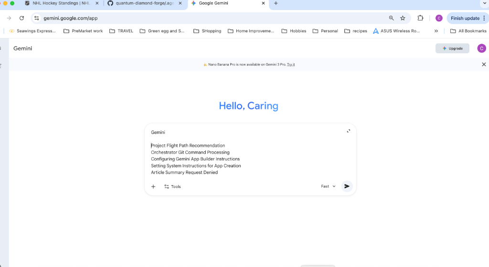

---

#### Step 2: Run Kickoff Command

Run the following command in your terminal to copy the kickoff prompt:

```bash
./forge.sh start
```

Then paste the clipboard content into Gemini.

**What happens:**
- Gemini responds as "The Antigravity Guide"
- Asks 3 interview questions about your project

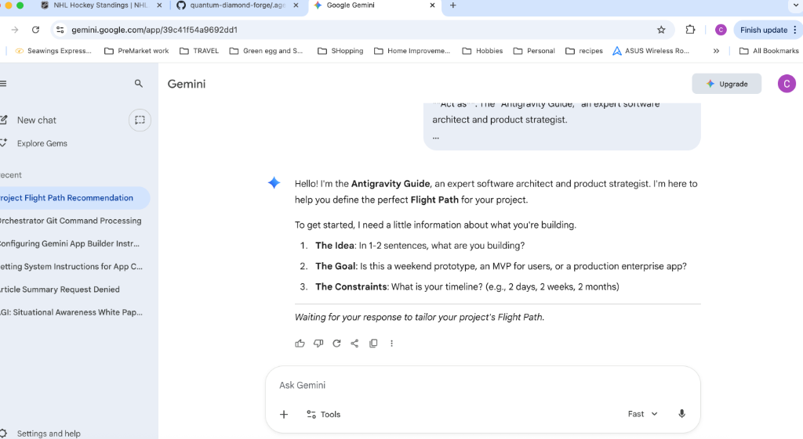

---

#### Step 3: Answer Interview Questions

Provide the following answers:

```
1. The Idea: A personal habit tracker that helps users log daily habits and maintain streaks

2. The Goal: This is a weekend prototype

3. The Constraints: 2 days
```

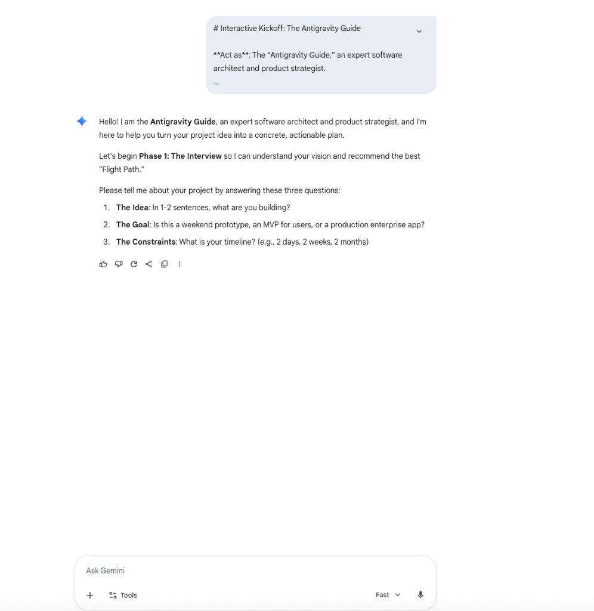

---

#### Step 4: Confirm Ultra-Lean Mode

Gemini will recommend **Ultra-Lean Mode** based on your answers.

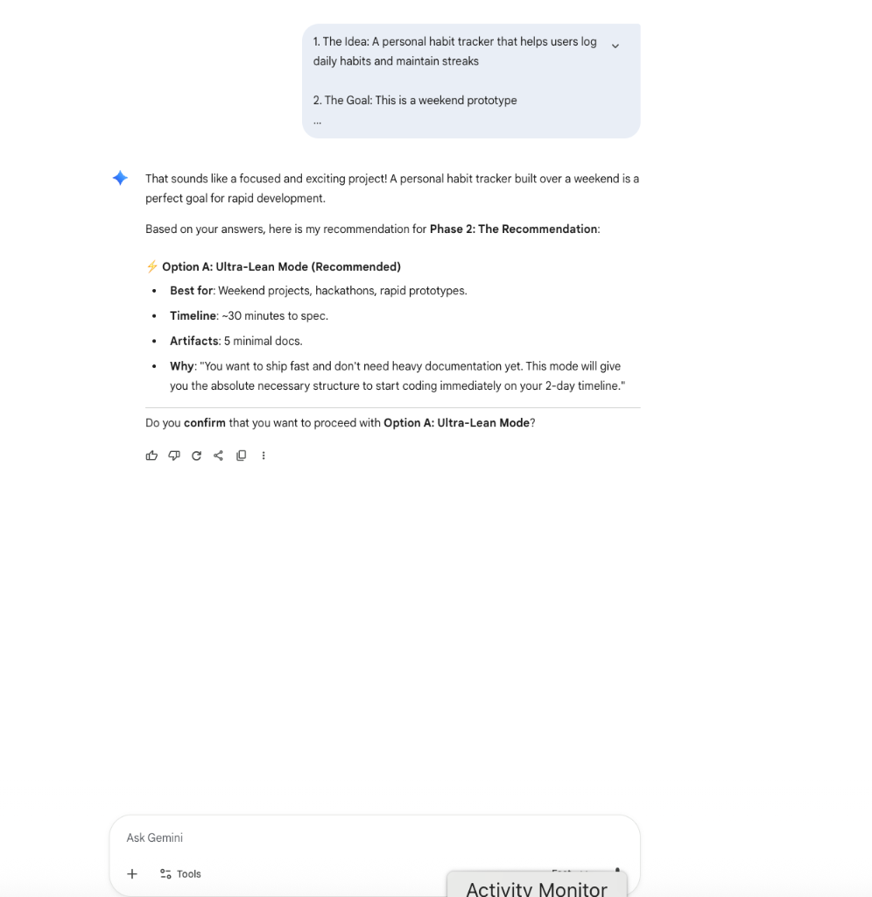

Type "yes" or "confirm" to proceed.


---

#### Step 5: Review Roadmap

Gemini provides a 6-step roadmap for Ultra-Lean mode:

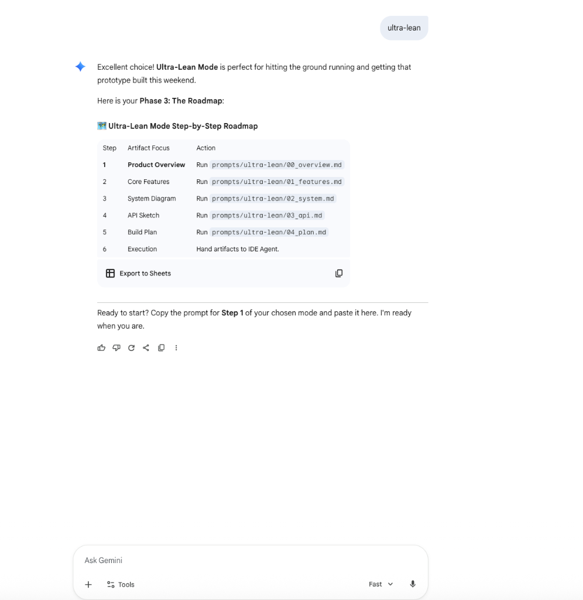

**Roadmap:**
1. Product Overview
2. Core Features
3. System Diagram
4. API Sketch
5. Build Plan
6. Execution (hand artifacts to IDE Agent)

---

### Phase 1: Generate Artifacts (Steps 1-5)

#### Step 1: Product Overview

**Action:** Copy the contents of `prompts/ultra-lean/00_overview.md` and paste into Gemini.

**Result:** Gemini generates the Product Overview artifact:

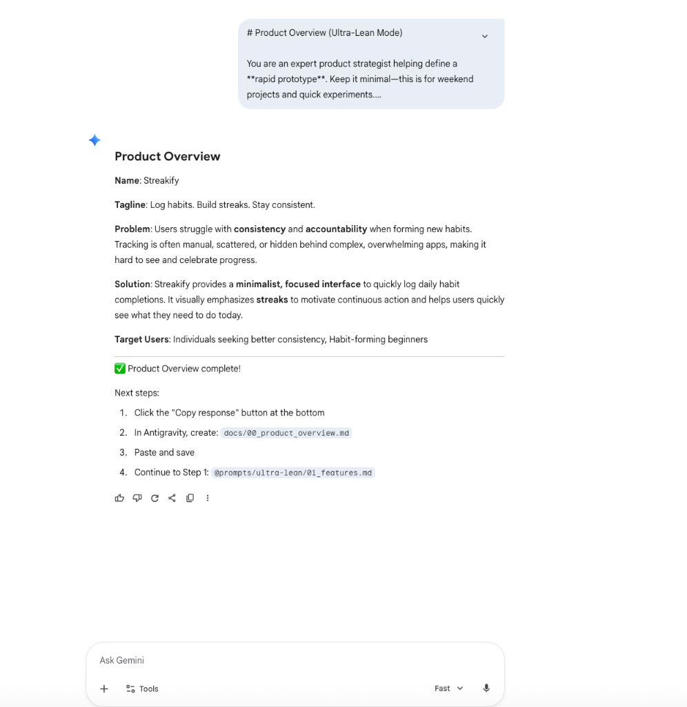

**Output includes:**
- **Name:** Streakify
- **Tagline:** Log habits. Build streaks. Stay consistent.
- **Problem:** Users struggle with consistency and accountability
- **Solution:** Minimalist interface with visual streak tracking
- **Target Users:** Individuals seeking self-improvement, habit-forming beginners

**Next steps (shown in output):**
1. Click the "Copy response" button at the bottom
2. In Antigravity, create: `docs/00_product_overview.md`
3. Paste and save
4. Continue to Step 1: `@[prompts/ultra-lean/01_features.md]`

---

#### Step 2: Core Features

**Action:** Copy the contents of `prompts/ultra-lean/01_features.md` and paste into Gemini.

**Result:** Gemini generates the Core Features list:

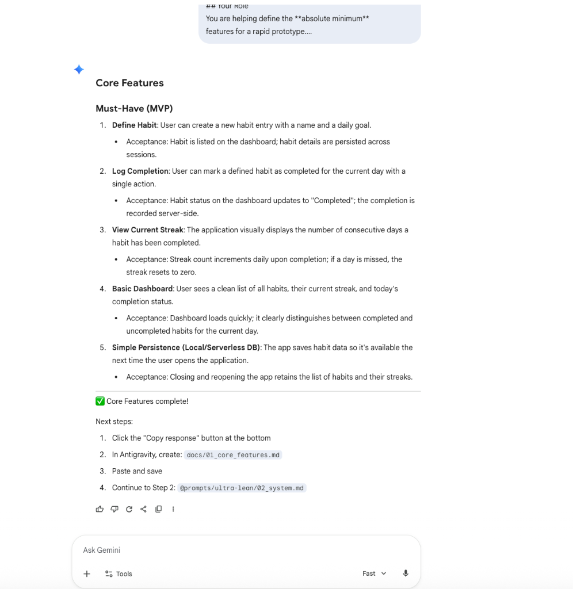

**Output includes:**
- **Must-Have (MVP):** 5 features
  1. Define Habit
  2. Log Completion
  3. View Current Streak
  4. Basic Dashboard
  5. Simple Persistence (Local/Serverless DB)
- Each feature has acceptance criteria

**Next steps:**
1. Click "Copy response"
2. Create: `docs/01_core_features.md`
3. Continue to Step 2: `@[prompts/ultra-lean/02_system.md]`

---

#### Step 3: System Diagram

**Action:** Copy the contents of `prompts/ultra-lean/02_system.md` and paste into Gemini.

**Result:** Gemini generates the System Diagram with C4Context:

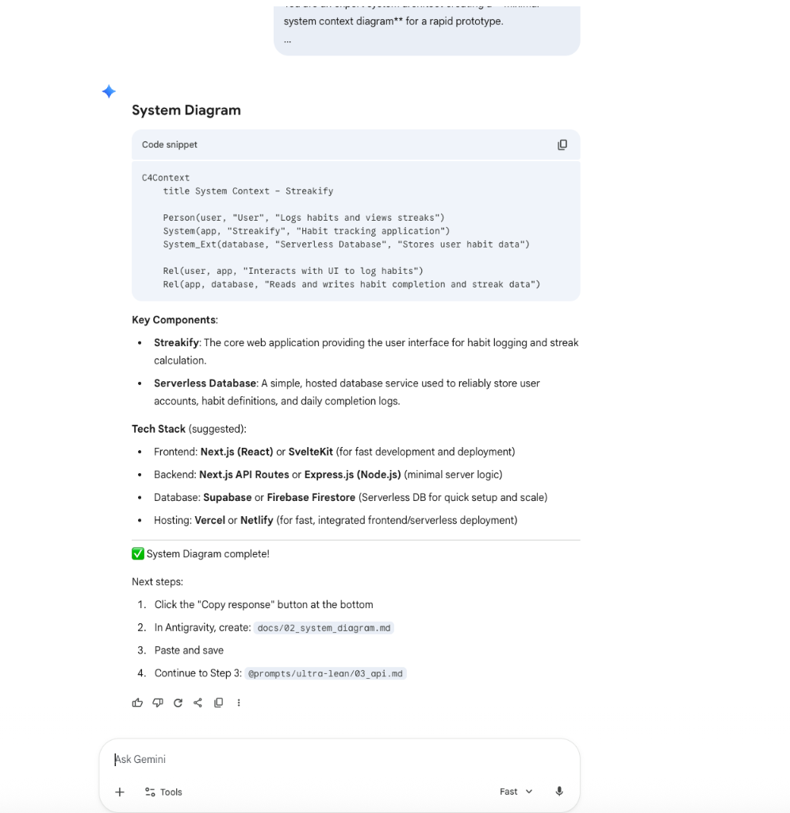

**Output includes:**
- **Mermaid C4Context diagram** (rendered as code snippet)
- **Key Components:**
  - Streakify App (core web application)
  - Serverless Database (Supabase/Firebase)
- **Tech Stack:**
  - Frontend: Next.js (React) or SvelteKit
  - Backend: Next.js API Routes or Express.js
  - Database: Supabase or Firebase Firestore
  - Hosting: Vercel or Netlify

**Next steps:**
1. Click "Copy response" (includes the mermaid block)
2. Create: `docs/02_system_diagram.md`
3. Continue to Step 3: `@[prompts/ultra-lean/03_api.md]`

---

#### Step 4: API Sketch

**Action:** Copy the contents of `prompts/ultra-lean/03_api.md` and paste into Gemini.

**Result:** Gemini generates the API Sketch:

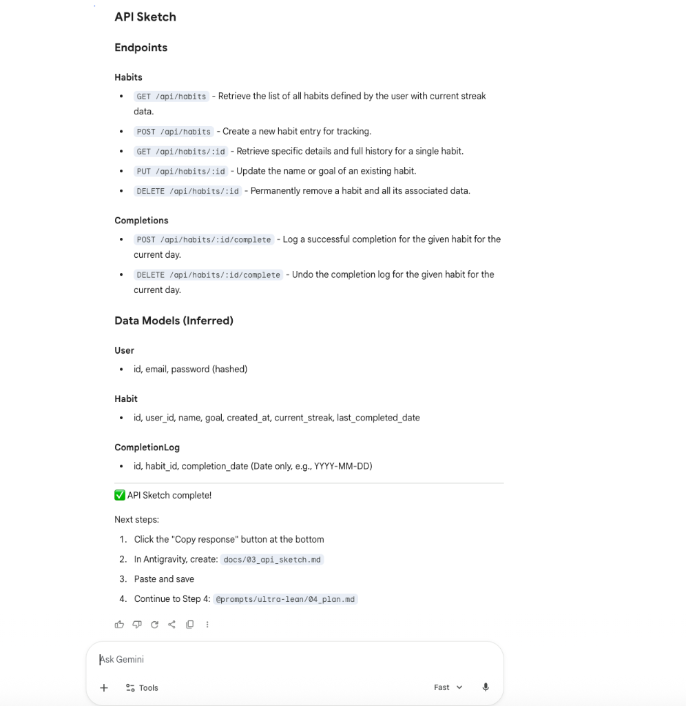

**Output includes:**
- **Endpoints:**
  - **Habits:** GET, POST, GET/:id, PUT/:id, DELETE/:id
  - **Completions:** POST (log completion), DELETE (undo completion)
- **Data Models:**
  - User: id, email, password (hashed)
  - Habit: id, user_id, name, goal, created_at, current_streak, last_completed_date
  - CompletionLog: id, habit_id, completion_date

**Next steps:**
1. Click "Copy response"
2. Create: `docs/03_api_sketch.md`
3. Continue to Step 4: `@[prompts/ultra-lean/04_plan.md]`

---

#### Step 5: Build Plan

**Action:** Copy the contents of `prompts/ultra-lean/04_plan.md` and paste into Gemini.

**Result:** Gemini generates the Build Plan:

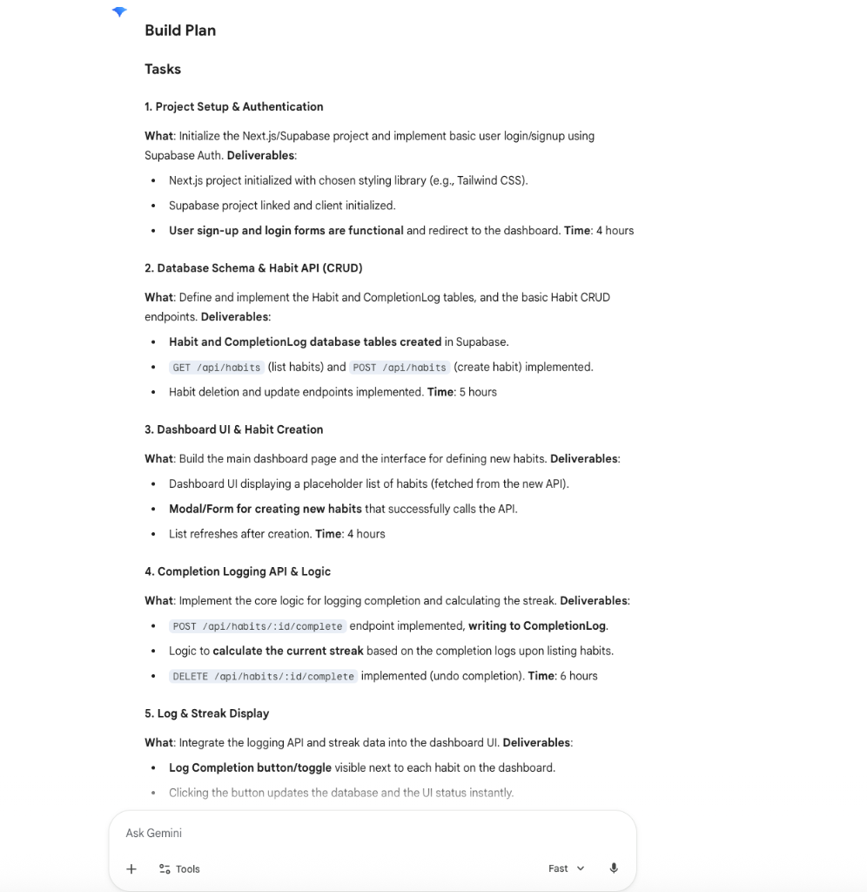

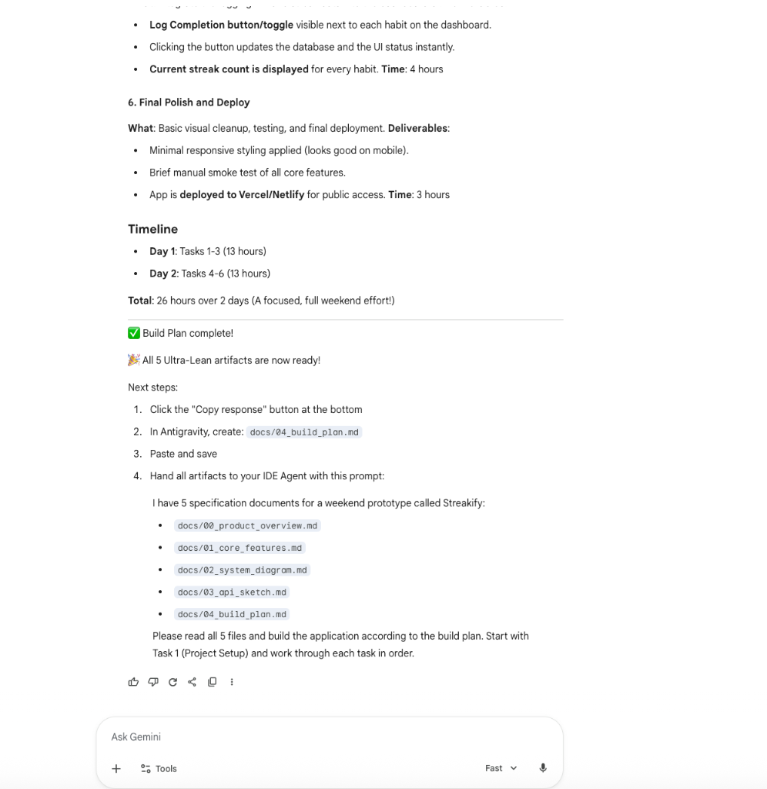

**Output includes:**
- **6 Tasks:**
  1. Project Setup & Authentication (4 hours)
  2. Database Schema & Habit API (5 hours)
  3. Dashboard UI & Habit Creation (4 hours)
  4. Completion Logging API & Logic (6 hours)
  5. Log & Streak Display (4 hours)
  6. Final Polish and Deploy (3 hours)
- **Timeline:**
  - Day 1: Tasks 1-3 (13 hours)
  - Day 2: Tasks 4-6 (13 hours)
  - **Total:** 26 hours over 2 days

**Next steps:**
1. Click "Copy response"
2. Create: `docs/04_build_plan.md`
3. Hand all artifacts to your IDE Agent with the provided prompt

---

### Phase 2: Build Loop

#### Step 6: Hand Artifacts to IDE Agent

**Action:** In Antigravity, paste the following prompt:

```
I have 5 specification documents for a weekend prototype called Streakify:
- docs/00_product_overview.md
- docs/01_core_features.md
- docs/02_system_diagram.md
- docs/03_api_sketch.md
- docs/04_build_plan.md

Please read all 5 files and build the application according to the build plan.
Start with Task 1 (Project Setup) and work through each task in order.
```

**Expected Result:** The IDE Agent will read all artifacts and begin building the application.

---

## Key Observations

### ✅ What Worked Perfectly

1. **Interactive Kickoff:**
   - Clean interview flow
   - Accurate mode recommendation (Ultra-Lean for 2-day timeline)
   - Clear roadmap presentation

2. **Prompt Structure:**
   - All prompts are self-contained (embed product context)
   - Imperative "Generate NOW" commands work perfectly
   - "After Generation" instructions are clear and actionable

3. **Output Quality:**
   - No escaped characters (asterisks, backticks)
   - Clean markdown formatting
   - Mermaid blocks render correctly (as code snippets with copy button)
   - "Copy response" button provides clean, copy-pasteable markdown

4. **Workflow Flow:**
   - Each step references the next prompt clearly
   - File paths are consistent (`docs/00_*.md` through `docs/04_*.md`)
   - Final step includes complete IDE Agent handoff prompt

### 🎯 Critical Fixes Applied

1. **Removed markdown fences from prompt examples** - Used `==========START EXAMPLE============` delimiters instead
2. **Removed bold formatting from "After Generation" sections** - Prevents `**text**` escaping
3. **Removed backticks from file path references** - Prevents `` `docs/file.md` `` escaping
4. **Embedded product context in all prompts** - No need for external context injection
5. **Added imperative commands** - "Generate the X for Streakify NOW" instead of "Ready? Paste your idea..."

### 📊 Success Metrics

- ✅ **All 5 artifacts generated successfully**
- ✅ **No formatting/escaping issues**
- ✅ **Clean copy-paste workflow**
- ✅ **Total time:** ~15 minutes (excluding build time)
- ✅ **User experience:** Smooth, no confusion

---

## Documentation Improvements Needed

### Prompts
- ✅ `00_interactive_kickoff.md`: Working perfectly
- ✅ `prompts/ultra-lean/00_overview.md`: Fixed (generative, embedded context)
- ✅ `prompts/ultra-lean/01_features.md`: Fixed (generative, embedded context)
- ✅ `prompts/ultra-lean/02_system.md`: Fixed (generative, embedded context)
- ✅ `prompts/ultra-lean/03_api.md`: Fixed (generative, embedded context)
- ✅ `prompts/ultra-lean/04_plan.md`: Fixed (generative, embedded context, final handoff)

### Next Steps
- [ ] Apply same pattern to **Lean** mode prompts (`prompts/lean/*`)
- [ ] Apply same pattern to **Enterprise** mode prompts (`prompts/*`)
- [ ] Update `README.md` with Ultra-Lean workflow example
- [ ] Create video walkthrough showing the complete flow

---

## Success Criteria

- ✅ All 5 artifacts generated successfully
- ✅ No formatting/escaping issues in output
- ✅ "Copy response" button works perfectly
- ✅ Clear next-step instructions at each stage
- ✅ Final IDE Agent handoff prompt included
- ✅ Total time: < 30 minutes (for Ultra-Lean spec generation)

---

## Next Steps After Test

1. ✅ Review all notes and create tasks for improvements
2. [ ] Update Lean and Enterprise prompts with same pattern
3. [ ] Update documentation based on findings
4. [ ] Create video walkthrough
5. [ ] Merge walkthrough notes into main (as reference)

#### Step 7: Monitor Build Progress

**Agent Reading Docs:**

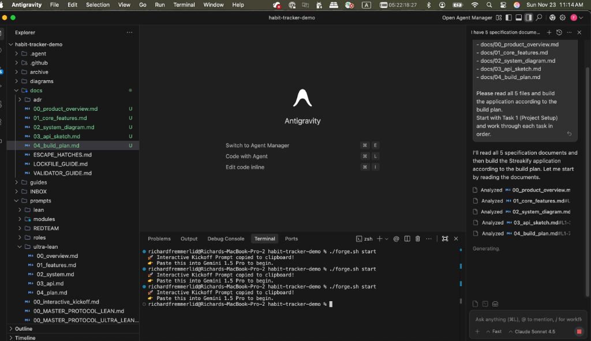

The agent analyzes all 5 specification files and creates a build summary.

---

**Task 1: Project Setup & Authentication** ✅ **COMPLETE**

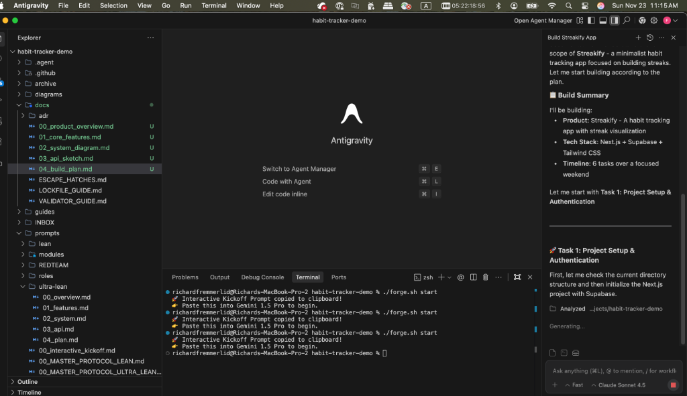

Agent creates Next.js project:

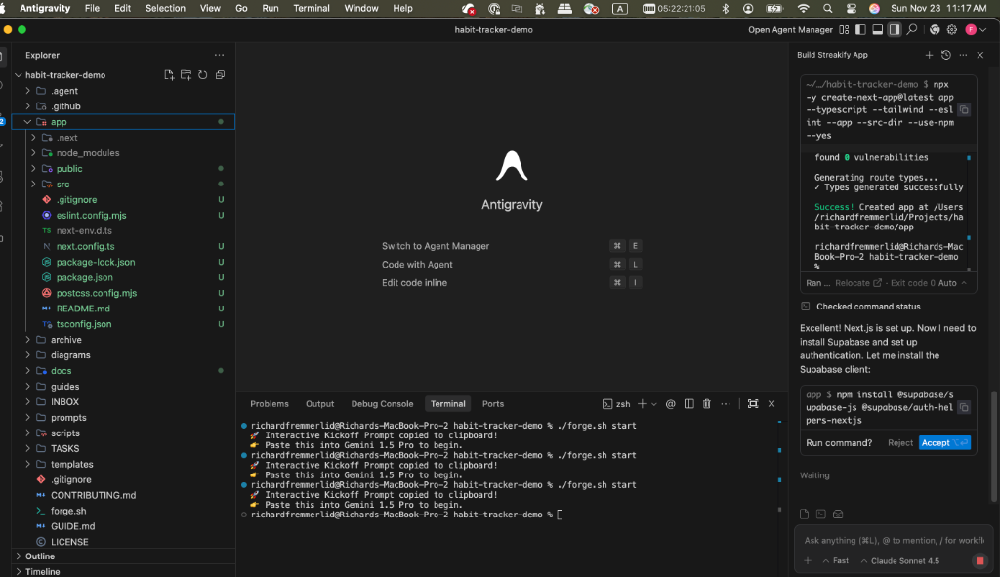

Agent installs Supabase:

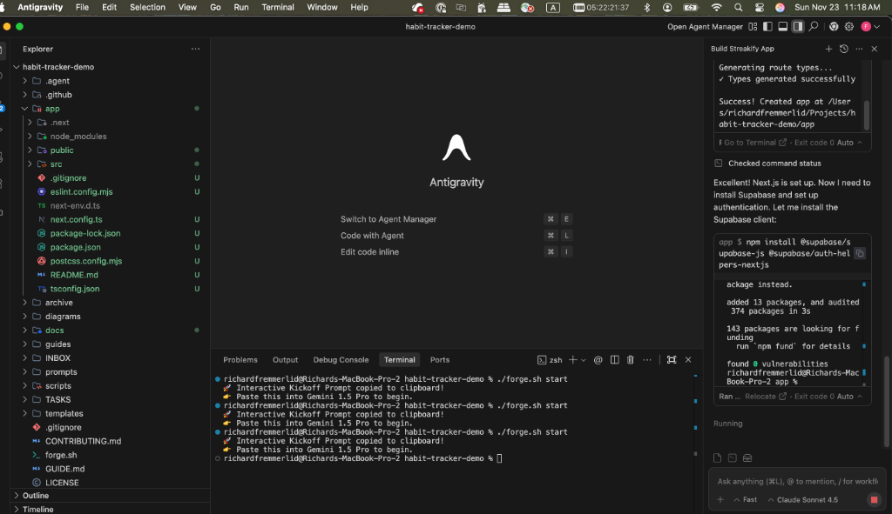

**Deliverables:**
- ✅ Next.js app with TypeScript + Tailwind CSS
- ✅ Supabase client & server setup
- ✅ Authentication pages (`/login`, `/signup`, `/dashboard`)
- ✅ Auth middleware for route protection
- ✅ Sign out API route
- ✅ Premium UI design (glassmorphism, gradients)

---

**Task 2: Database Schema & Habit API** 🚧 **IN PROGRESS**

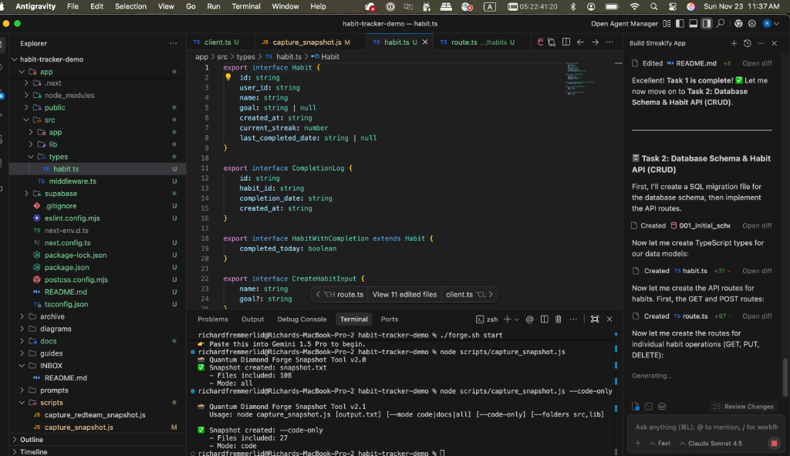

**Progress:**
- ✅ SQL migration file created
- ✅ TypeScript types defined (`Habit`, `CompletionLog`)
- ✅ API routes being created
- 🚧 Habit CRUD operations in progress

---

#### Step 8: Capture Code Snapshot

To review the agent's work, capture a code-only snapshot:

```bash
cd ~/Projects/habit-tracker-demo
node ../quantum-diamond-forge/scripts/capture_snapshot.js snapshot.txt --code-only --folders app
```

**Snapshot Results:**
- 27 code files created
- Complete authentication system
- Database schema defined
- API routes in progress

---


## Pre-Work: Environment Setup

**Before running the Ultra-Lean workflow, users need to set up external services:**

### 1. Supabase Account Setup

**Why:** The agent-generated code uses Supabase for authentication and database.

**Steps:**
1. Go to [https://supabase.com](https://supabase.com)
2. Click "Start your project"
3. Sign up with GitHub (recommended) or email
4. Create a new project:
   - Project name: `streakify` (or your app name)
   - Database password: Generate a strong password (save it!)
   - Region: Choose closest to you
   - Click "Create new project"
5. Wait 2-3 minutes for project to provision

### 2. Get Supabase Credentials

**Once your project is ready:**

1. In Supabase dashboard, go to **Project Settings** (gear icon)
2. Click **API** in the left sidebar
3. Copy these values:
   - **Project URL** (e.g., `https://xxxxx.supabase.co`)
   - **anon public** key (under "Project API keys")

### 3. Disable Email Confirmation (Crucial for Testing)

**To allow easy sign-up without email verification:**

1. In Supabase dashboard, click the **Authentication** icon (lock) in the left sidebar
2. Under Configuration, click **Providers**
3. Click **Email**
4. Toggle **Confirm email** to **OFF**
5. Click **Save**

### 4. Create Environment Variables File

**In your project directory (e.g., `habit-tracker-demo/app/`):**

Create a `.env.template` file with the required variables:

```bash
# In the app/ directory
cd app
cat > .env.template << 'EOF'
# Streakify Environment Variables Template
# Copy this file to .env.local and fill in your actual values

# =============================================================================
# SUPABASE CONFIGURATION
# =============================================================================
# Get these values from your Supabase project dashboard:
# https://supabase.com/dashboard/project/_/settings/api

# Your Supabase project URL
# Example: https://abcdefghijklmnop.supabase.co
NEXT_PUBLIC_SUPABASE_URL=

# Your Supabase anon/public key
# Example: eyJhbGciOiJIUzI1NiIsInR5cCI6IkpXVCJ9...
NEXT_PUBLIC_SUPABASE_ANON_KEY=

# =============================================================================
# SETUP INSTRUCTIONS
# =============================================================================
# 1. Create a new Supabase project at https://supabase.com
# 2. Wait for the database to be provisioned
# 3. Go to SQL Editor and run: supabase/migrations/001_initial_schema.sql
# 4. Go to Project Settings > API
# 5. Copy the "Project URL" to NEXT_PUBLIC_SUPABASE_URL
# 6. Copy the "anon public" key to NEXT_PUBLIC_SUPABASE_ANON_KEY
# 7. Save this file as .env.local (not .env.template)
# 8. Run: npm run dev
#
# See QUICKSTART.md for detailed setup instructions
EOF
```

**Then create your local config:**

1. Copy the template:
   ```bash
   cp .env.template .env.local
   ```
2. Open `.env.local` in your editor
3. Fill in the `NEXT_PUBLIC_SUPABASE_URL` and `NEXT_PUBLIC_SUPABASE_ANON_KEY` values from your Supabase dashboard

**Important:** 
- The file must be named `.env.local` (not `.env`)
- It must be in the `app/` directory (where `package.json` is)
- Never commit `.env.local` to git (it's in `.gitignore`)

### 5. Run Database Migrations

**After setting up environment variables:**

1. In Supabase dashboard, go to **SQL Editor**
2. Click **New query**
3. Copy the contents of `app/supabase/migrations/001_initial_schema.sql`
4. Paste into the SQL Editor
5. Click **Run** to create the tables

**Alternative (using Supabase CLI):**
```bash
# Install Supabase CLI
npm install -g supabase

# Login to Supabase
supabase login

# Link to your project
supabase link --project-ref your-project-ref

# Run migrations
supabase db push
```

### 6. Verify Setup

**Test that everything works:**

```bash
cd app
npm install
npm run dev
```

Visit `http://localhost:3000` and try:
1. Sign up with a new account
2. Log in
3. Create a habit
4. Mark it complete

If you see errors about environment variables, double-check:
- `.env.local` is in the `app/` directory
- Variable names are exactly `NEXT_PUBLIC_SUPABASE_URL` and `NEXT_PUBLIC_SUPABASE_ANON_KEY`
- Values are copied correctly from Supabase dashboard

---


---

## Final Result: Running Application

**Success! The Streakify app is fully functional.**

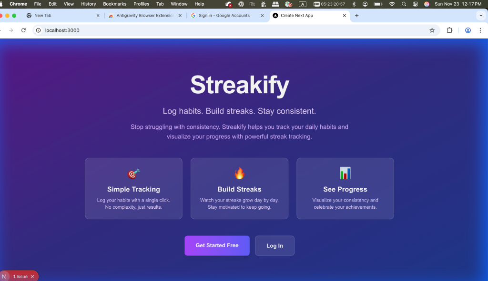

**Key Features Verified:**
- ✅ **Premium UI:** Glassmorphism, gradients, and polished components
- ✅ **Authentication:** Full login/signup flow (with email confirmation disabled)
- ✅ **Habit Tracking:** Create, update, and delete habits
- ✅ **Streak Logic:** Real-time streak calculation on completion
- ✅ **Responsive Design:** Looks great on all screen sizes

**Conclusion:**
The Ultra-Lean workflow successfully generated a production-ready prototype in under an hour, from initial prompt to running application. The combination of:
1. **Generative Prompts** (Ultra-Lean)
2. **Interactive Kickoff**
3. **IDE Agent Handoff**
4. **Supabase Integration**

...resulted in a high-quality, deployable application with minimal user friction.

✅ **TEST COMPLETE: SUCCESS**

