# Quantum Diamond Forge - Master Protocol (Lean Mode)

**Version**: 2.1 Lean  
**Audience**: Solo developers, MVPs, prototypes, small teams  
**Philosophy**: Speed + Essential Rigor

---

## What is Lean Mode?

Lean Mode is a **streamlined variant** of Protocol v2.0 designed for:
- Solo developers building MVPs
- Prototypes and proof-of-concepts
- Small teams moving fast
- Projects that don't require full enterprise compliance

**What You Skip:**
- C4 Level 2-3 diagrams (keep Level 1 only)
- Detailed threat modeling tables (basic security checklist instead)
- Extensive non-functional requirements
- Full test pyramid (focus on unit + integration)

**What You Keep:**
- Core requirements (feature catalog, user stories)
- Basic architecture (C4 Level 1, API design, data models)
- Essential security (AuthN/AuthZ, encryption)
- Practical testing (unit + integration tests)
- Implementation plan

---

## The Lean Workflow

```mermaid
graph TD
    User["👤 You"] -->|1. Idea| WebLLM["🧠 Web LLM"]
    WebLLM -->|2. Lean Specs| Specs["📄 Essential Docs"]
    Specs -->|3. Guides| Agent["🤖 IDE Agent"]
    Agent -->|4. Builds| Code["💻 MVP Code"]
```

### Phase 1: Specification Loop (Lean)

#### Step 1: Requirements (Lean)
**Prompt**: `prompts/lean/01_requirements_analysis.md`

**Output**: `docs/01_REQUIREMENTS.md`
- Feature catalog (Must-Have + Should-Have only)
- 3-5 key user stories
- Basic acceptance criteria

**Time**: ~10 minutes

---

#### Step 2: Architecture (Lean)
**Prompt**: `prompts/lean/02_architecture_design.md`

**Output**: `docs/02_ARCHITECTURE.md`
- C4 Level 1 (System Context only)
- API endpoint list (no full OpenAPI spec)
- Data models (tables + key relationships)

**Time**: ~15 minutes

---

#### Step 3: Security (Lean)
**Prompt**: Use standard `prompts/03_security_compliance.md` but focus on:
- AuthN/AuthZ strategy
- Encryption at rest/transit
- Input validation
- Skip: Full STRIDE, compliance mapping

**Output**: `docs/03_SECURITY.md` (simplified)

**Time**: ~10 minutes

---

#### Step 4: Testing (Lean)
**Prompt**: `prompts/lean/04_testing_strategy.md`

**Output**: `docs/04_TESTING.md`
- Unit test strategy
- Integration test strategy
- Skip: E2E, performance, security testing

**Time**: ~10 minutes

---

#### Step 5: Implementation Plan (Lean)
**Prompt**: `prompts/lean/05_implementation_plan.md`

**Output**: `docs/05_IMPLEMENTATION.md`
- Task breakdown (focus on MVP features)
- Dependency order
- Skip: Detailed ADRs, rollback plans

**Time**: ~10 minutes

---

### Phase 2: Build Loop

Use the standard Antigravity agent workflow:
1. Point agent to `docs/05_IMPLEMENTATION.md`
2. Agent reads specs and builds features
3. Agent runs tests
4. Iterate

---

## When to Upgrade to Enterprise Mode

Switch to full Protocol v2.0 when:
- You're raising funding
- You need SOC2/HIPAA compliance
- Team grows beyond 5 people
- You're handling sensitive data (PII, PHI, financial)
- You need detailed audit trails

---

## Escape Hatches

### "I just want to prototype"
Skip Steps 3-4 entirely. Just do:
1. Requirements (Step 1)
2. Architecture (Step 2)
3. Build

### "I need to iterate mid-build"
- Update the relevant `docs/*.md` file
- Tell the agent: "Requirements changed, re-read docs/01_REQUIREMENTS.md"
- Continue building

### "This is taking too long"
- Use verbosity controls in prompts (select "Lightweight" when asked)
- Skip optional sections
- Focus on Must-Have features only

---

## Lean Mode Checklist

- [ ] Read this guide
- [ ] Run Step 1 (Requirements)
- [ ] Run Step 2 (Architecture)
- [ ] Run Step 3 (Security) - optional but recommended
- [ ] Run Step 4 (Testing) - optional but recommended
- [ ] Run Step 5 (Implementation Plan)
- [ ] Point IDE agent to `docs/05_IMPLEMENTATION.md`
- [ ] Build!

---

## Comparison: Lean vs Enterprise

| Aspect | Lean Mode | Enterprise Mode |
|--------|-----------|-----------------|
| **Artifacts** | ~10 docs | 25+ docs |
| **Time to Spec** | ~1 hour | ~4-6 hours |
| **C4 Diagrams** | Level 1 only | Levels 1-3 |
| **Threat Modeling** | Checklist | Full STRIDE tables |
| **Testing** | Unit + Integration | Full pyramid + perf + security |
| **Compliance** | None | SOC2, HIPAA, GDPR |
| **Best For** | MVPs, prototypes | Production, enterprises |

---

## Next Steps

1. Copy `prompts/lean/01_requirements_analysis.md` to your Web LLM
2. Paste your idea
3. Save the output to `docs/01_REQUIREMENTS.md`
4. Repeat for Steps 2-5
5. Start building!

**Need full rigor?** Switch to `prompts/00_MASTER_PROTOCOL.md` (Enterprise Mode)
