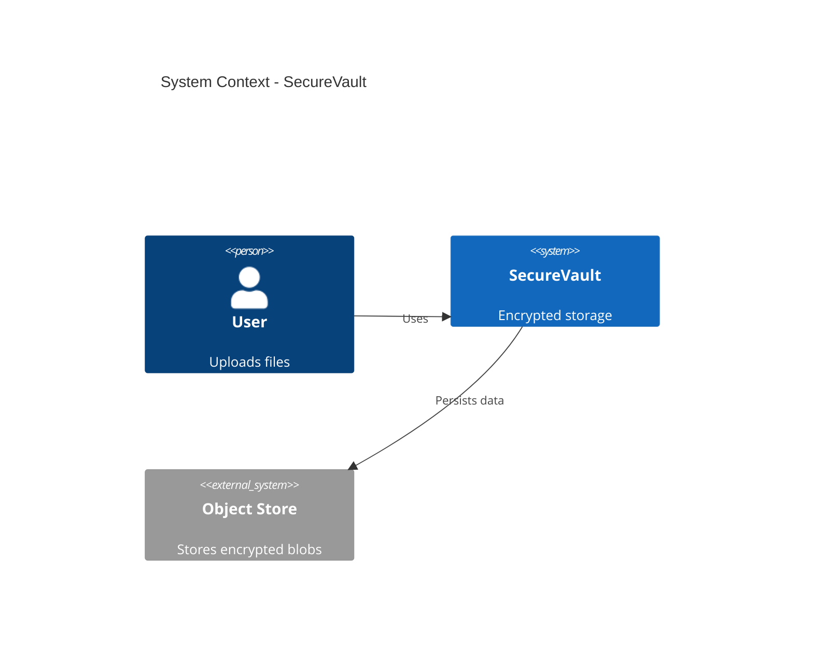
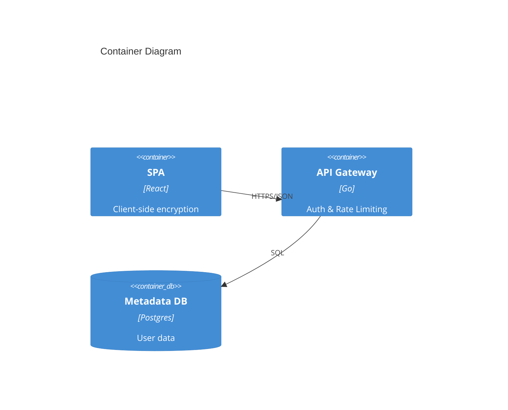
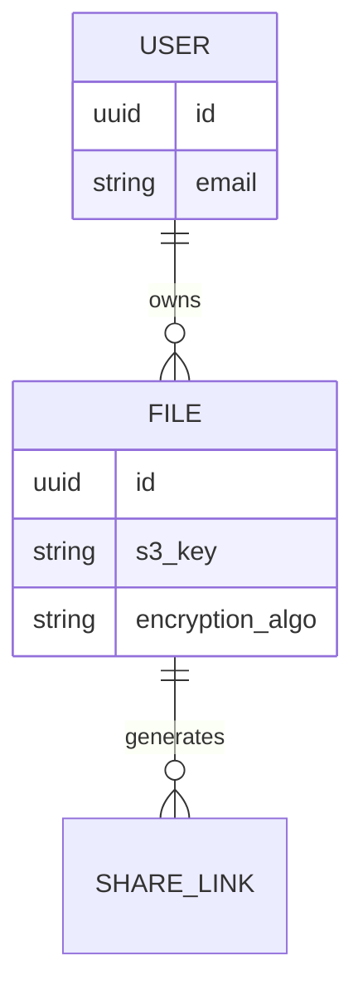

# Architecture Design (Enterprise Mode)

You are a Principal Software Architect. Your goal is to generate a **Comprehensive Technical Blueprint** for a production-grade system.

**Context:**
You have the requirements from the previous step. Now you must design a scalable, secure, and maintainable architecture.

---

## Your Task

Generate an **Architecture Document** using the exact structure below.
**DO NOT** ask clarifying questions.
**GENERATE THE DOCUMENT IMMEDIATELY.**

---

## Output Structure

# Architecture Design

## 1. System Context (C4 Level 1)

```mermaid
C4Context
    title System Context
    ...
```

## 2. Container Architecture (C4 Level 2)

```mermaid
C4Container
    title Container Diagram
    ...
```

### Technology Stack
- **Frontend**: [Framework, State Management]
- **Backend**: [Language, Framework]
- **Database**: [Primary, Cache, Search]
- **Infra**: [Cloud Provider, Orchestration]

## 3. Data Model

```mermaid
erDiagram
    ENTITY ||--o{ OTHER : relation
    ...
```

## 4. API Design Strategy
- **Style**: [REST/GraphQL/gRPC]
- **Auth**: [OAuth2/OIDC/JWT]

### Key Endpoints
- `[Method] [Path]` - [Description]

## 5. Cross-Cutting Concerns
- **Observability**: [Logging, Metrics, Tracing]
- **Error Handling**: [Standardized responses]
- **Caching**: [Strategy]
- **Resilience**: [Circuit Breakers, Retries]

---

## Example (for reference only)

==========START EXAMPLE============

# Architecture Design

## 1. System Context (C4 Level 1)



## 2. Container Architecture (C4 Level 2)



### Technology Stack
- **Frontend**: React, WebCrypto API
- **Backend**: Go (Gin), OpenTelemetry
- **Database**: PostgreSQL (Metadata), S3 (Blobs)
- **Infra**: AWS EKS (Kubernetes)

## 3. Data Model



## 4. API Design Strategy
- **Style**: RESTful JSON API
- **Auth**: OAuth2 via Auth0

### Key Endpoints
- `POST /v1/files/upload-url` - Get presigned S3 URL
- `POST /v1/files/finalize` - Register uploaded file

## 5. Cross-Cutting Concerns
- **Observability**: ELK Stack for logs, Prometheus for metrics.
- **Error Handling**: RFC 7807 Problem Details.
- **Caching**: Redis for user sessions and file metadata.
- **Resilience**: Retry with exponential backoff on S3 failures.

==========END EXAMPLE============

---

## After Generation

Once you have generated the document, tell the user:

> ✅ **Architecture Document complete!**
>
> **Next steps:**
> 1. Click the "Copy response" button at the bottom
> 2. In Antigravity, create: `docs/02_architecture.md`
> 3. Paste and save
> 4. Run Step 3: `prompts/enterprise/03_security_compliance.md`
