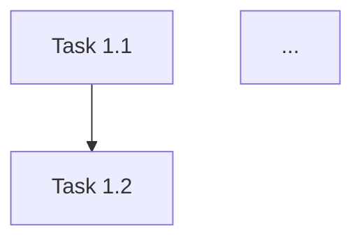
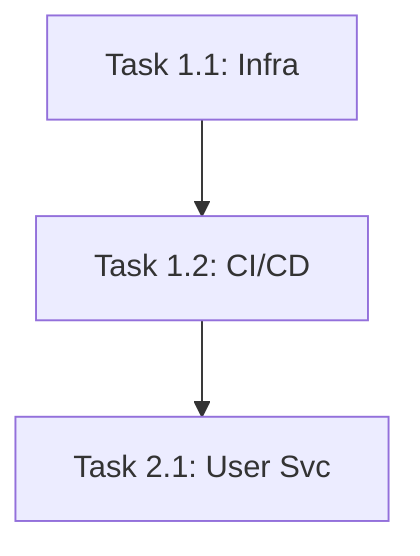

# Implementation Plan (Enterprise Mode)

You are a Technical Project Manager. Your goal is to generate a **Detailed Implementation Plan** for a large-scale project.

**Context:**
You have the full specification (Requirements, Architecture, Security, Testing). Now you must create a phased plan for execution.

---

## Your Task

Generate an **Implementation Plan** using the exact structure below.
**DO NOT** ask clarifying questions.
**GENERATE THE DOCUMENT IMMEDIATELY.**

---

## Output Structure

# Implementation Plan

## 1. Phases Overview
### Phase 1: Infrastructure & Foundation
- [Goal]

### Phase 2: Core Services
- [Goal]

### Phase 3: Feature Development
- [Goal]

## 2. Detailed Task Breakdown

### Phase 1: Infrastructure & Foundation

#### Task 1.1: [Name]
**Description**: [What to do]
**Deliverables**:
- [ ] [Item 1]
- [ ] [Item 2]

...

## 3. Critical Path (Dependency Graph)



## 4. Launch Checklist
- [ ] [Security Audit]
- [ ] [Load Test Sign-off]
- [ ] [UAT Sign-off]

---

## Example (for reference only)

==========START EXAMPLE============

# Implementation Plan

## 1. Phases Overview
### Phase 1: Infrastructure & Foundation
- Set up AWS, K8s, CI/CD, and Auth0.

### Phase 2: Core Services
- Build User Service and File Service skeleton.

### Phase 3: Feature Development
- Implement Encryption, Uploads, and Sharing.

## 2. Detailed Task Breakdown

### Phase 1: Infrastructure & Foundation

#### Task 1.1: Cloud Infrastructure
**Description**: Provision VPC, EKS, and RDS via Terraform.
**Deliverables**:
- [ ] Terraform state backend configured
- [ ] VPC and Subnets created
- [ ] EKS Cluster running

#### Task 1.2: CI/CD Pipeline
**Description**: Set up GitHub Actions for build, test, and deploy.
**Deliverables**:
- [ ] Build workflow (Docker build)
- [ ] Test workflow (Unit + Integration)
- [ ] Deploy workflow (Helm upgrade)

### Phase 2: Core Services

#### Task 2.1: User Service
**Description**: Implement user management and Auth0 integration.
**Deliverables**:
- [ ] gRPC definitions
- [ ] Auth middleware
- [ ] User profile CRUD

## 3. Critical Path



## 4. Launch Checklist
- [ ] 3rd-party Pen Test completed
- [ ] SOC2 Type II audit evidence collected
- [ ] Load test passed at 10k RPS

==========END EXAMPLE============

---

## After Generation

Once you have generated the document, tell the user:

> ✅ **Implementation Plan complete!**
>
> **Next steps:**
> 1. Click the "Copy response" button at the bottom
> 2. In Antigravity, create: `docs/05_plan.md`
> 3. Paste and save
> 4. **BUILD THE APP:**
>    Copy the prompt below and paste it into the IDE Agent (Antigravity) to start building:
>
> ```
> I have 5 specification documents for an Enterprise Project:
> - docs/01_requirements.md
> - docs/02_architecture.md
> - docs/03_security.md
> - docs/04_testing.md
> - docs/05_plan.md
>
> Please read all 5 files and build the application according to the implementation plan.
> Start with Task 1.1 and work through each task in order.
> ```
