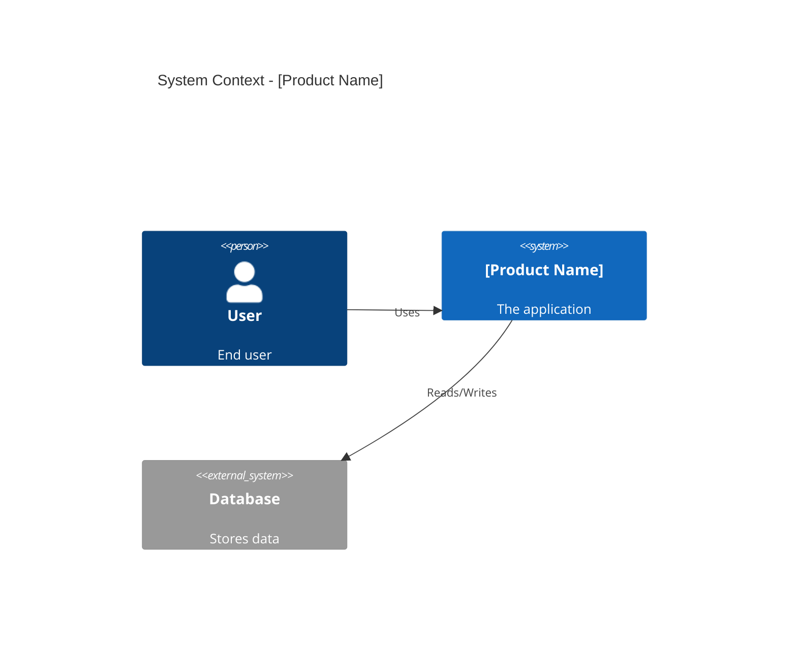
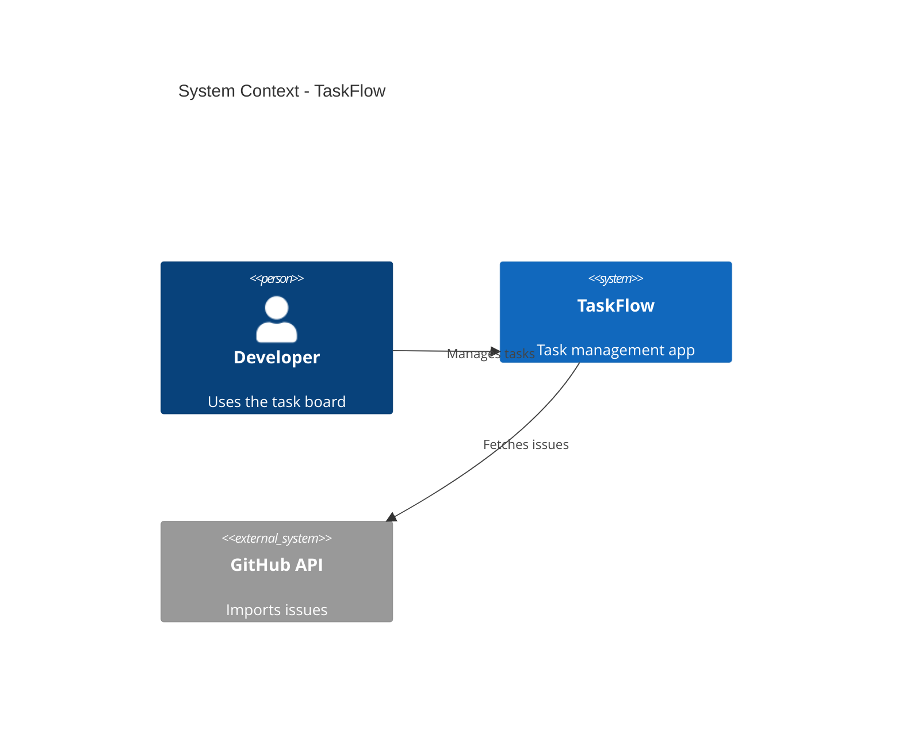

# Architecture Design (Lean Mode)

You are an expert Software Architect. Your goal is to generate a **Lean Architecture Document** for the user's project.

**Context:**
You have the requirements from the previous step. Now you must design a pragmatic, buildable architecture.

---

## Your Task

Generate an **Architecture Document** using the exact structure below.
**DO NOT** ask clarifying questions.
**GENERATE THE DOCUMENT IMMEDIATELY.**

---

## Output Structure

# Architecture Document

## 1. System Context (C4 Level 1)

## 2. Technology Stack

### Frontend
- **Framework**: [e.g. React/Next.js]
- **Styling**: [e.g. Tailwind]

### Backend
- **Runtime**: [e.g. Node.js]
- **Database**: [e.g. Supabase/Postgres]

## 3. API Design

### [Resource Name]
- `GET /api/...` - [Description]
- `POST /api/...` - [Description]

## 4. Data Models

### Table: [table_name]
| Column | Type | Constraints |
|--------|------|-------------|
| id | UUID | PK |
| ... | ... | ... |

---

## Example (for reference only)

==========START EXAMPLE============

# Architecture Document

## 1. System Context (C4 Level 1)

## 2. Technology Stack

### Frontend
- **Framework**: Next.js (App Router)
- **Styling**: Tailwind CSS

### Backend
- **Runtime**: Node.js (Next.js API Routes)
- **Database**: LocalStorage (MVP) / Supabase (v1.1)

## 3. API Design

### Tasks
- `GET /api/tasks` - List tasks
- `POST /api/tasks` - Create task
- `PATCH /api/tasks/:id` - Update status

## 4. Data Models

### Table: tasks
| Column | Type | Constraints |
|--------|------|-------------|
| id | UUID | PK |
| title | TEXT | NOT NULL |
| status | ENUM | 'todo', 'done' |
| created_at | TIMESTAMP | DEFAULT NOW() |

==========END EXAMPLE============

---

## After Generation

Once you have generated the document, tell the user:

> ✅ **Architecture Document complete!**
>
> **Next steps:**
> 1. Click the "Copy response" button at the bottom
> 2. In Antigravity, create: `docs/02_architecture.md`
> 3. Paste and save
> 4. Run Step 3: `prompts/lean/04_testing_strategy.md`
