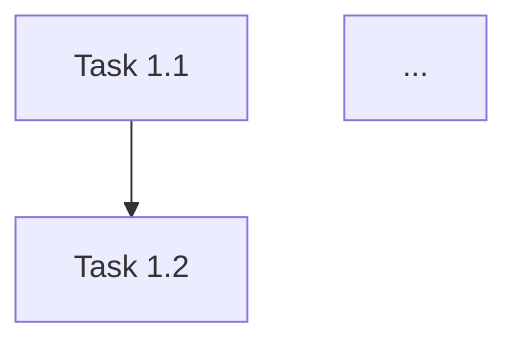
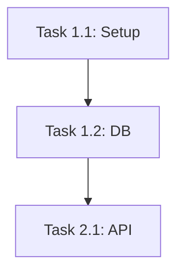

# Implementation Plan (Lean Mode)

You are an expert Technical Lead. Your goal is to generate a **Lean Implementation Plan** for the user's project.

**Context:**
You have the full specification (Requirements, Architecture, Testing). Now you must create a step-by-step plan for the AI Agent to build it.

---

## Your Task

Generate an **Implementation Plan** using the exact structure below.
**DO NOT** ask clarifying questions.
**GENERATE THE DOCUMENT IMMEDIATELY.**

---

## Output Structure

# Implementation Plan

## 1. Phases
### Phase 1: Foundation
- [Goal]

### Phase 2: Core Features
- [Goal]

## 2. Task Breakdown

### Phase 1: Foundation

#### Task 1.1: [Name]
**Description**: [What to do]
**Deliverables**:
- [ ] [Item 1]
- [ ] [Item 2]

...

## 3. Dependency Graph



## 4. MVP Checklist
- [ ] [Critical Feature 1]
- [ ] [Critical Feature 2]

---

## Example (for reference only)

==========START EXAMPLE============

# Implementation Plan

## 1. Phases
### Phase 1: Foundation
- Set up project, database, and auth.

### Phase 2: Core Features
- Build task CRUD and board UI.

## 2. Task Breakdown

### Phase 1: Foundation

#### Task 1.1: Project Setup
**Description**: Initialize Next.js app with Tailwind and Supabase.
**Deliverables**:
- [ ] Create Next.js app
- [ ] Configure Tailwind
- [ ] Set up Supabase client

#### Task 1.2: Database Schema
**Description**: Create tables in Supabase.
**Deliverables**:
- [ ] Create `users` table
- [ ] Create `tasks` table

### Phase 2: Core Features

#### Task 2.1: Task API
**Description**: Build CRUD endpoints.
**Deliverables**:
- [ ] `POST /api/tasks`
- [ ] `GET /api/tasks`

## 3. Dependency Graph



## 4. MVP Checklist
- [ ] User can log in
- [ ] User can create task
- [ ] User can see task list

==========END EXAMPLE============

---

## After Generation

Once you have generated the document, tell the user:

> ✅ **Implementation Plan complete!**
>
> **Next steps:**
> 1. Click the "Copy response" button at the bottom
> 2. In Antigravity, create: `docs/05_plan.md`
> 3. Paste and save
> 4. **BUILD THE APP:**
>    Copy the prompt below and paste it into the IDE Agent (Antigravity) to start building:
>
> ```
> I have 4 specification documents for a Lean MVP:
> - docs/01_requirements.md
> - docs/02_architecture.md
> - docs/04_testing.md
> - docs/05_plan.md
>
> Please read all 4 files and build the application according to the implementation plan.
> Start with Task 1.1 and work through each task in order.
> ```
