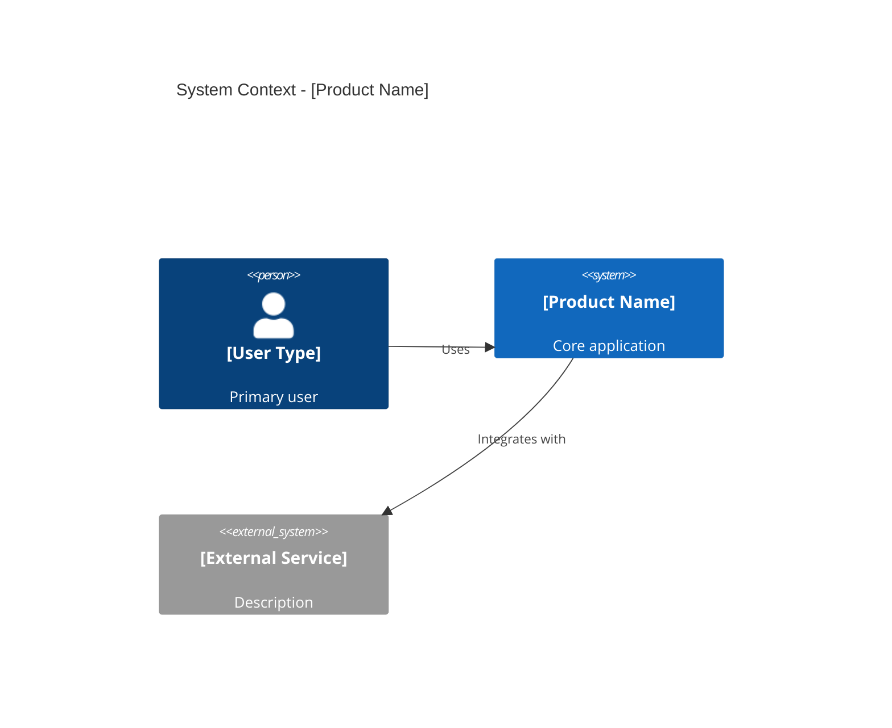

# System Diagram (Ultra-Lean Mode)

You are an expert system architect creating a **minimal system context diagram** for a rapid prototype.

**Product:** Streakify - A personal habit tracker that helps users log daily habits and maintain streaks

**Timeline:** 2 days (weekend prototype)

**Context from Previous Steps:**
- **Problem:** Users struggle to maintain consistency with new habits
- **Solution:** Minimalist interface for logging daily habit completions with visible streak counts
- **Core Features:** Define Habit, Log Completion, View Dashboard, Calculate Streak, User Authentication

---

## Your Task

Generate a **System Diagram** for Streakify using the exact structure below.

**Rules:**
- **C4 Level 1 only** - Just system context, no containers or components
- **Show only essentials** - Main system + 1-2 external dependencies
- **One sentence per component** - No detailed descriptions
- **Suggest simple tech** - Proven, easy-to-deploy stack
- **Keep it simple**: No microservices, no Kubernetes
- **Boring tech wins**: Use proven, well-documented tools
- **Optimize for speed**: Choose tech you can deploy in minutes

---

## Output Structure

# System Diagram

**Key Components**:
<!-- - **[Product Name]**: [One-sentence description] -->
- **[External Service]**: [One-sentence description]

**Tech Stack** (suggested):
- Frontend: [Framework]
- Backend: [Framework]
- Database: [Database]
- Hosting: [Platform]

---

## Example (for reference only)

==========START EXAMPLE============

# System Diagram

**Key Components**:
- **QuickPoll**: Web app that manages polls and votes
- **Web Browser**: Displays poll UI and results

**Tech Stack** (suggested):
- Frontend: React (Vite)
- Backend: Node.js (Express)
- Database: SQLite (local file)
- Hosting: Vercel (frontend) + Railway (backend)

==========END EXAMPLE============

---

**Generate the System Diagram for Streakify NOW.**

---

## After Generation

Once you've generated the System Diagram, tell the user:

> ✅ System Diagram complete!
> 
> Next steps:
> 1. Click the "Copy response" button at the bottom
> 2. In Antigravity, create: docs/02_system_diagram.md
> 3. Paste and save
> 4. Continue to Step 3: @[prompts/ultra-lean/03_api.md]
